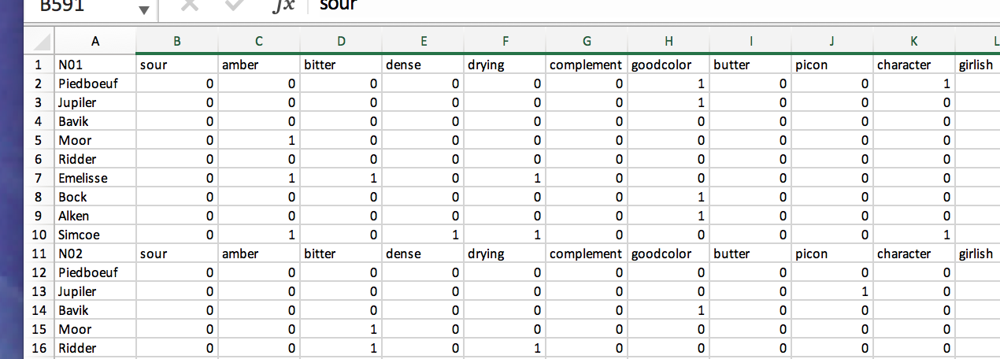

```{r, eval = FALSE,ECHO = FALSE , include = FALSE}
knitr::opts_knit$get()
```


```{r note, include = FALSE, ECHO = FALSE, eval = FALSE}
**NOTE:** 

This `pdf` was generated from the vignette
`R4SPISE2018::cheeseMCA` from the `R` Package 
`R4SPISE2018`. Check the help for the 
very last version of this document.
```


# Prelude

If you want to make sure that you have a clean start,
you can execute the following commands:
```{r , include = TRUE, echo = TRUE}
rm(list = ls())
graphics.off()
```
Or, better (see below, preamble), you can use an `Rproject` for this project.

```{r setup, include = FALSE, ECHO = FALSE}
# Important: Remember 
#     build the vignettes with devtools::build_vignettes()
knitr::opts_chunk$set(
  collapse = TRUE,
  fig.width = 9,
  comment = "#>"
)
```

```{r, eval = FALSE,ECHO = FALSE , include = FALSE}
knitr::opts_knit$get()
```


# Preamble


Make sure that you start this analysis as a new `Rproject` so that
the default directory will be correctly set, and the memory cleared.

Before we start the analysis,
we need to have our standard packages installed (including some from `Github`) 
and the corresponding libraries loaded:

* `DistatisR`
* `PTCA4CTA`
* `R4SPISE2018`
* `prettyGraphs`
* `ExPosition`

## load

```{r loadPackages}
# Decomment all/some 0f these lines if the packages are not installed
# devtools::install_github('HerveAbdi/PTCA4CATA')
# devtools::install_github('HerveAbdi/DistatisR')
#  install.packages(prettyGraphs)
#  install.packages('Matrix')
#  install.packages('factoextra')
#
#  load the libraries that we will need
suppressMessages(library(Matrix))
suppressMessages(library(DistatisR))
suppressMessages(library(PTCA4CATA))
suppressMessages(library(prettyGraphs))
suppressMessages(library(ExPosition))
suppressMessages(library(factoextra))


```


# Introduction

The data set can be found from the package `R4SPISE2018.`
The data are stored in an excel file called 
`beersNovicesExpertsCATA.xlsx`
whose location
can be found and stored in the
variable `path2file` using the  `R` function `system.functionfile()`
as shown in the following command:
```{R findDataPath}
path2file <- system.file("extdata",
       "beersNovicesExpertsCATA.xlsx", package = "R4SPISE2018")
```

```{r xls.datafile, echo=FALSE, fig.cap="The Data Excel File \\label{fig:spicesxl}", fig.height=3, fig.width=4, include=TRUE, out.width='70%'}
# label.spicesxl = capFigNo
# 


```


if you open this excel file, it will look like the
Figure above. 
The sorting data are stared in the sheet `DataSort.`
The first columns gives the names of the products 
(here spices) and each column 
that were sorted


When you record you own data,
make sure that you follow the same format, this way the script
described in this vignette will apply 
to your own analysis with minimal change.

We will first compute the results of the analysis, then create 
the graphics, and finally save everything into a powerpoint.

# Run the statistical analysis

## Read the data

The excel file name and location (i.e., path) are
stored in the variable `path2file`. 
To read the data we will use the function
`PTCA4CATA::read.xls.CATAl()` 
(based upon
the function `readxl::read_excel()`).


### How to save the data file

To save the data file 
(under the original name of `myDataFile`
or maybe a more informative name)
in a directory 
(say `Downloads`). use the following command

```{r savexls}
saveFile <- file.copy(from = path2file, to = '~/Downloads/myDataFile.xlsx')
```


## Back to the data and norming

In addition we are norming the responses of the Judges
so that each row for each Judges sums to 1.
```{r readCATAData}
dataCATA.list <- read.xls.CATA(path2file   = path2file, 
                                sheet2read = 'DataCATA',
                                threshold4cleaning = 5)
# norm
dataCube <- normBrick4PTCA(dataCATA.list$CATA.Brick ,
                                normingConstant = 100,
                                normalization = "byRow",
                                code4Groups = NULL)$normedArray
# get the contingency table from the cube
contingencyTable <- apply(dataCube,c(1,2),sum)
```

```{r getParam}
nI <- dim(dataCube)[[1]]
nJ <- dim(dataCube)[[2]]
nK <- dim(dataCube)[[3]]
namesR <- dimnames(dataCube)[[1]]
namesC <- dimnames(dataCube)[[2]]
namesA <- dimnames(dataCube)[[3]]
```


The variables are organized in block.
First we get the blocks, then we keep only
the variables that passed the threshold for cleaning
(see parameter `threshold4cleaning`).
The categories of the CATA descriptors are stored in the file
`beersNovicesExpertsCATA.xlsx` (whose path is stored in the
variable `path2file`) in the sheet `Categories4Descriptors`.
We read them with the function `readxl::read_excel`


```{r getBlock}
catDescriptors.tmp <- as.data.frame(readxl::read_excel(path2file, 
                                  'Categories4Descriptors'))
catDescriptors <- catDescriptors.tmp[catDescriptors.tmp[,1] %in% namesC,]
```


The assessors are also described by several variables.
These data are stored in the file
`beersNovicesExpertsCATA.xlsx` (whose path is stored in the
variable `path2file`) in the sheet `DescriptionJuges`.
We read them with the function `readxl::read_excel`:

```{r getCat4Judges}
descJudges  <- as.data.frame(readxl::read_excel(path2file, 
                                  'DescriptionJuges'))
```

```{r getColors}
# Color for the descriptors
col4Emotion <- "red4"
col4Context <- "darkmagenta"
col4Taste   <- "darkolivegreen"
color4Attributes <- rep("", nJ)
color4Attributes[catDescriptors$Category == 'C'] <- col4Context
color4Attributes[catDescriptors$Category == 'E'] <- col4Emotion
color4Attributes[catDescriptors$Category == 'G'] <- col4Taste
# Color for the products from prettyGraphs
color4Products <- prettyGraphs::prettyGraphsColorSelection(nI)
# Color for the Judges Novices vs Experts
col4Experts  <- 'mediumpurple4'
col4Novices  <- 'olivedrab3'
color4Participants <- rep(col4Experts, nK)
color4Participants[descJudges$Expertise == 'N'] <- col4Novices
# color4Participants[descJudges$Expertise == 'E'] <- col4Experts
```


# Descriptive approach

## Get Cochran Q

```{r Q4CATA}
# Compute Cochran's Q from the cube of data
Q4CATA  <- Q4CATA.Cube(dataCube)
# Create the vector of probability stars
zeStars <-  p2Star( Q4CATA['Sidak p(FW)',])
```

## Create a Heat Map (with significant levels)
```{r heatMap}
a.000.zeMapCATA <- makeggHeatMap4CT(
                   CTstared(contingencyTable,zeStars,'after'),
                            colorAttributes = color4Attributes,
                            colorProducts = color4Products)
```

### Print the heat map

```{r printHM}
print(a.000.zeMapCATA)

```

# CA: descriptive and inferences

## Correspondence analysis on the contingency table


```{r resCA}
# The CA
ResCATACA <- epCA(contingencyTable,
                        masses = NULL, weights = NULL, 
                        hellinger = FALSE,
                        symmetric = TRUE, graphs = FALSE)
# Renormalize the results of CA
RenomrFi <- CARenormalization(G = ResCATACA$ExPosition.Data$fi ,
                  delta = ResCATACA$ExPosition.Data$pdq$Dv,
                  singularValues = TRUE,
                  masses = NULL)
```


## Bootstrap Inferences


### Bootstrap and bootstrap ratios:


```{r bootCA}
#
bootCA <- Boot4PTCA(ZeDataCube = dataCube,
           fi = ResCATACA$ExPosition.Data$fi,
           fj = ResCATACA$ExPosition.Data$fj,
           eigs = ResCATACA$ExPosition.Data$eigs,
           nf2keep = 3,
           nBootIter = 500)
# Compute Bootstraped ratios
bootRatios.I <- PTCA4CATA::boot.ratio.test(bootCA$RowsBoot,
                                            critical.value = 2)
bootRatios.J <- PTCA4CATA::boot.ratio.test(bootCA$ColumnsBoot,
                                              critical.value = 2)
# Probabilities 
probBR.I  <- bootRatios.I$prob.boot.ratios
probBR.J  <- bootRatios.J$prob.boot.ratios
```


### Permutation tests 

```{r permut}
# from PTCA4CATA
#
ResCATACA.inference <- perm4PTCA(aCube = dataCube,
                                nIter = 1000,
                                permType = 'byRows' ,
                                Malinvaud = TRUE)
Ind.Permu    <-  ResCATACA.inference$permInertia
InertiaFixed <- ResCATACA.inference$fixedInertia
prob.cpt.lst <- ResCATACA.inference$MalinvaudQ['p-perm',]
# Get the p values for the components
prob.cpt <- (unlist(prob.cpt.lst[2:length(prob.cpt.lst)]))
prob.cpt[is.na(prob.cpt)] <- 1
```


## Participants analysis

```{r ca4Judges}
Cmat <- createCmat4PTCA(dataCube)
# To find the observations Kept:
#   dimnames((ZeRawDataCube))[[3]] %in% rownames(Cmat)
eigenCmat <- eigen(Cmat, symmetric = TRUE)
#
eig4Cmat <-  eigenCmat$values
tau4Cmat <- round( (100*eig4Cmat) / sum(eig4Cmat))
nk       <- 3
F4Cmat   <- eigenCmat$vectors[,1:nk] %*% diag(eig4Cmat[1:nk]^(1/2))
rownames(F4Cmat) <- rownames(Cmat)
```


# Graphics


## RV analysis on the participants


## Scree

```{r screeRV, fig.height = 4, fig.width = 8}
# Scree plot with significance
ScreeInf <- PlotScree(ev = eig4Cmat,
             max.ev = NULL, alpha = 0.05,
             col.ns = "#006D2C", col.sig = "#54278F",
             title = "RV Analysis: Explained Variance per Dimension")
a000.00.screeRV <-  recordPlot()
```


## Participant maps

```{r rv4Judges}
Shortnames4Participants <-  substr(rownames(F4Cmat),1,1)
F4Plot <- F4Cmat
rownames(F4Plot) <- Shortnames4Participants
# Make labels
labels4RV <- createxyLabels.gen(1,2,lambda = eig4Cmat, tau = tau4Cmat )

```


```{r mapRv}
# 
BaseMap.Participants <- createFactorMap(X = F4Plot ,
                              axis1 = 1, axis2 = 2,
                              constraints = NULL,
                              title = NULL,
                              col.points = color4Participants,
                              display.points = TRUE,
                              pch = 19, cex = 2.5,
                              display.labels = TRUE,
                              col.labels = color4Participants,
                              text.cex = 4, font.face = "bold",
                              font.family = "sans",
                              col.axes = "darkorchid",
                              alpha.axes = 0.2,
                              width.axes = 1.1,
                              col.background = adjustcolor("lavender",
                                                       alpha.f = 0.2),
                              force = 1, segment.size = 3)

a.01.Map4Partipants <- BaseMap.Participants$zeMap_background + 
                          BaseMap.Participants$zeMap_dots + labels4RV
a.02.Map4Partipants.labels <- BaseMap.Participants$zeMap_background +
                                BaseMap.Participants$zeMap_text + labels4RV
```

```{r graphJudges.1, fig.cap="RV map for Judges \\label{fig:rv4Judges}", fig.height=3, fig.width= 8}
print(a.01.Map4Partipants + ggtitle('The Rv Map')) # How to add a title when printing
```

```{r graphJudges.2,  fig.cap="RV map for Judges, with names \\label{fig:rv4Judges2}", fig.height=3, fig.width= 8}
print(a.02.Map4Partipants.labels)
```

### Plot mean and confidence intervals


```{r meanFunction}
getMeans <- function(G, factor, FUN = mean){
  # A function to get the mean by groups
  groupMean.tmp  <- aggregate(G, list(factor), FUN) 
  groupMean <- groupMean.tmp[,2:ncol(groupMean.tmp )] 
  rownames(groupMean) <- groupMean.tmp[,1]
  return(groupMean)
}
```

```{r rvGroups}
# Get the factors from the Cmat analysis
ExpertiseMeans <- getMeans(F4Cmat, descJudges$Expertise)
# Bootstrap for CI
BootCube <- PTCA4CATA::Boot4Mean(F4Cmat, design = descJudges$Expertise,
                      niter = 100,
                      suppressProgressBar = TRUE)
# head(BootCube)
```

```{r makeMapCI}
# First the means
# A tweak for colors
col4Group <- c(col4Experts,col4Novices)
#
gg.rv.means <- PTCA4CATA::createFactorMap(ExpertiseMeans,
axis1 = 1, axis2 = 2, 
constraints = BaseMap.Participants$constraints, title = NULL,
col.points =  col4Group ,
alpha.points = 1, # no transparency
display.points = TRUE,
pch = 19, cex = 5,
display.labels = TRUE,
col.labels = col4Group , 
  text.cex = 4,
font.face = "bold",
font.family = "sans", col.axes = "darkorchid", 
alpha.axes = 0.2, width.axes = 1.1, 
col.background = adjustcolor("lavender", alpha.f = 0.2), 
force = 1, segment.size = 0)
#
 dimnames(BootCube$BootCube)[[2]] <- 
                    paste0('Dimension ',1 : dim(BootCube$BootCube)[[2]])
  #c('Dim1','Dim2') 
GraphElli.rv <- MakeCIEllipses(BootCube$BootCube[,1:2,],
                 names.of.factors = c("Dimension 1","Dimension 2"), 
                 col = col4Group, 
                 p.level = .95)
a.03.gg.RVMap.CI <- a.01.Map4Partipants + gg.rv.means$zeMap_dots + GraphElli.rv 
```


As can be seen in the map, Experts and Novices 
are significantly different (but not strongly because
the two samples clearly overlap).
```{r printRV, fig.cap="RV map for Judges, with Means and Confidence Intervals\\label{fig:rv4Judges2}", fig.height=3, fig.width= 8}
print(a.03.gg.RVMap.CI)
```

## More description of the Judges

Here we use as additional information the other variables that
we have collected on the participants:
`Age`, `Sex` and, `Consumption.`
We will *bin* age in three levels (with the function
`ggplot2::cut_number()`)
```{r ageBin}
ageBin <- ggplot2::cut_number(descJudges$Age, 4)
levelsAge <- levels(ageBin)
# rename the levels for clarity
levels(ageBin) <- list(A1 = "[25,35]",  A2 = "(35,45]",
                               A3 = "(45,54.5]", A4 =  "(54.5,67]") 
```

The variable `Consumption` is quite unbalanced
as can be seen from its `summary`

```{r  csum}
summary(as.factor(descJudges$Consumption))
```

so we decide to combine the values 4 and 3 (to do so 
we recode the value 4 as 3):
```{r recC}
descJudges$Consumption[descJudges$Consumption == 4] <- 3
```

### Project on the RV Map

First we compute the means per group:
```{r projRV}
Age <- getMeans(F4Cmat, ageBin) 
Sex <- getMeans(F4Cmat, descJudges$Sex)
Con <- getMeans(F4Cmat, descJudges$Consumption)
rownames(Con) <- c('C1', 'C2', 'C3')
```
Concatenate:

```{r projRV2}
GroupMeans4RV = rbind(Age,Sex,Con,ExpertiseMeans)
```

Get colors

```{r projRV3}
col4Means.gr <- prettyGraphs::prettyGraphsColorSelection(n.colors = 4)
col4Means <- c(rep(col4Means.gr[1],4), rep(col4Means.gr[2],2), 
               rep(col4Means.gr[3],3), rep(col4Means.gr[4],2) )
```

Project the mean onto the RV map.

```{r}
colnames(GroupMeans4RV) <- paste0('Dimension ',1:ncol(GroupMeans4RV))
gg.rv.groups <- PTCA4CATA::createFactorMap(GroupMeans4RV,
constraints = BaseMap.Participants$constraints, 
title = 'Judges Variables',
col.points =  col4Means,
alpha.points = 1, # no transparency
cex = 1,
col.labels = col4Means)
```

```{r plotRV2, fig.cap="RV map for Judges, with Barycenters \\label{fig:rv4Judges.bary}", fig.height=3, fig.width= 8}
a.04a.gg.RVMap.Gr <- gg.rv.groups$zeMap + labels4RV
print(a.04a.gg.RVMap.Gr)
```

The map has the same scale as the participant map, 
and it shows that none of the variables under consideration 
explain much of the variance of the participants.

## Post-Hoc Analysis: Exploring the individual participants between participants

Here we conduct a hierarchical cluster analysis on the factor score
```{r HCA}
 D <- dist(F4Cmat, method = "euclidean")
 fit <- hclust(D, method = "ward.D2")
 a05.tree4participants <- fviz_dend(fit,  k = 1, 
                        k_colors = 'burlywood4', 
                        label_cols = color4Participants[fit$order],
                        cex = .4, xlab = 'Participants',
                        main = 'Cluster Analysis: Participants') 
```

```{r plothca, fig.height = 9, fig.width = 9}
 print(a05.tree4participants)
```

The tree confirms that Novices and Experts do not differ 
in an important way because the analysis does not separate one group
 from the other. 
The tree, however, suggests that there are two groups of participants,
and further analysis should be performed to identify the rouses of
these differences. One way of doing so could be to plot
the tree categories on the map.

## Cut the tree in two

```{r cutTree}
grpParticipants <- cutree(fit, k = 2)
```
### Color the RV Plot by participant

Get the colors
```{r treeOnRv}
col4Gr <- prettyGraphs::createColorVectorsByDesign(
             ExPosition::makeNominalData(as.matrix(grpParticipants))
)
```


Make the plot

```{r  treeOnRV2, fig.width = 9}
BaseMap.Participants.tree <- createFactorMap(X = F4Plot ,
                              title = 'The RV map colored from the tree',
                              col.points = col4Gr$oc,
                              display.labels = TRUE,
                              col.labels = col4Gr$oc)

a.05.Map4Partipants.tree <- BaseMap.Participants.tree$zeMap_background + 
                          BaseMap.Participants.tree$zeMap_dots + labels4RV
```

```{r treeOnRV3, fig.width = 9}
print(a.05.Map4Partipants.tree)
```
As expected form the very large proportion of explained variance
by the first dimension, the tree splits the participants 
according to
their position of Dimension.
A possible interpretation for Dimension could be that 
it reflects the number of descriptors chosen,
but this interpretation needs to be confirmed.

**A Question:** How can we confirm this conjecture?


## Plot for Cochran's Q

```{r plotQ, fig.width = 9}
# Temporary version before a ggplot2 version
UnC.criticalC = .05
CritChi <- qchisq(p = 1 - UnC.criticalC ,NROW(contingencyTable) -1)
Plot4Q <- PrettyBarPlotColor4Q((Q4CATA[1,]),
                                color4bar = rep('darkorchid4',
                                                ncol(Q4CATA)),
                                threshold = CritChi , # Critical value,
                                main = 'Chi2 for Q (uncorrected) ',
                                ylab = 'Chi2 for Q')
b00.Q.Uncorrected <-  recordPlot()
```

```{r plotQ.cor, fig.width = 9}
C.criticalC = 1 - (1 - UnC.criticalC)^(1/ncol(Q4CATA))
CritChi.C <- qchisq(p = 1 - C.criticalC, NROW(contingencyTable) - 1)
Plot4Q <- PrettyBarPlotColor4Q((Q4CATA[1,]),
                               color4bar = rep('darkorchid4',
                                               ncol(Q4CATA)),
                               threshold = CritChi.C , # Critical value,
                               main = 'Chi2 for Q (Sidak corrected) ',
                               ylab ='Chi2 for Q')
b01.Q.Corrected <-  recordPlot()

```


## Scree Plot for CA (with significance)


```{r screeCA, fig.height = 4, fig.width = 9}
# Scree plot with significance
ScreeInf <- PlotScree(ev = ResCATACA$ExPosition.Data$eigs,
             p.ev = prob.cpt,
         #ResCATANovicesCA.inference$Inference.Data$components$p.vals,
             max.ev = NULL, alpha = 0.05,
             col.ns = "#006D2C", col.sig = "#54278F",
             title = "Explained Variance per Dimension")
c00.screeCA.inf <-  recordPlot()
```


## Factorial Plots

### I and J sets together

# 2. Descriptive Fi and Fj


```{r makeMapIJ}
x_axis = 1
y_axis = 2
xyLabels <- createxyLabels(ResCATACA,x_axis = x_axis, y_axis = y_axis)
BaseMap.Fi <- createFactorMap(X = RenomrFi$G_A,
                              axis1 = x_axis, 
                              axis2 = y_axis,
                              constraints = NULL,
                              title = NULL, col.points = color4Products,
                              display.points = TRUE,
                              pch = 19, cex = 2.5,
                              display.labels = TRUE,
                              col.labels = color4Products,
                              text.cex = 4, font.face = "bold",
                              font.family = "sans",
                              col.axes = "darkorchid", alpha.axes = 0.2,
                              width.axes = 1.1,
                              col.background = adjustcolor("lavender",
                                                           alpha.f = 0.2),
                              force = 1, segment.size = 0)
BaseMap.Fj <- createFactorMap(X = ResCATACA$ExPosition.Data$fj,
                              axis1 = x_axis, 
                              axis2 = y_axis,
                              constraints = BaseMap.Fi$constraints,
                              title = NULL, col.points = color4Attributes,
                              display.points = TRUE,
                              pch = 19, cex = 1,
                              display.labels = TRUE,
                              col.labels = color4Attributes,
                              text.cex = 2.5, font.face = "bold",
                              font.family = "sans",
                              col.axes = "darkorchid", alpha.axes = 0.2,
                              width.axes = 1.1,
                              col.background = adjustcolor("lavender",
                                                           alpha.f = 0.2),
                              force = 2, segment.size = 0)

d01.BaseMap.Fij <- BaseMap.Fi$zeMap + BaseMap.Fj$zeMap_dots + xyLabels
d02.BaseMapNoDoti.Fij  <- BaseMap.Fi$zeMap_background +
  BaseMap.Fi$zeMap_text +
  BaseMap.Fj$zeMap_dots  + xyLabels
d03.BaseMapNoLabeli.Fij  <- BaseMap.Fi$zeMap_background +
  BaseMap.Fi$zeMap_dots +
  BaseMap.Fj$zeMap_text  + xyLabels
```

An asymmetric map

```{r Fij.v1, fig.cap="I and J sets \\label{fig:Fij1}", fig.height = 9}
print(d01.BaseMap.Fij )
```

```{r Fij.v2, fig.cap="I and J sets \\label{fig:Fij2}", fig.height = 9}
print(d02.BaseMapNoDoti.Fij)
```

```{r Fij.v3, fig.cap="I and J set \\label{fig:Fij3}", fig.height = 9}
print(d03.BaseMapNoLabeli.Fij, )
```

### Plot (Q-) Significant Descriptors

To make the graph more readable, we can
highlight the significant descriptors (as identified from Cochran's Q), plot in grey
the non-significant descriptors.

```{r  plotQSig}
color4AttributesCorrected <- color4Attributes
col4ns <-  'gray80'  # Color for NS Attribute
color4AttributesCorrected[Q4CATA[3,] >= UnC.criticalC ] <- col4ns

BaseMap.Fj.cor <- createFactorMap(X = ResCATACA$ExPosition.Data$fj,
                              axis1 = 1, axis2 = 2,
                              constraints = BaseMap.Fi$constraints,
                              title = NULL,
                              col.points = color4AttributesCorrected,
                              display.points = TRUE,
                              pch = 19, cex = 1,
                              display.labels = TRUE,
                              col.labels = color4AttributesCorrected,
                              text.cex = 2.5, font.face = "bold",
                              font.family = "sans",
                              col.axes = "darkorchid", alpha.axes = 0.2,
                              width.axes = 1.1,
                              col.background = adjustcolor("lavender",
                                                           alpha.f = 0.2),
                              force = 2, segment.size = 0)
e01.BaseMap.Fij.cor <- BaseMap.Fi$zeMap + BaseMap.Fj.cor$zeMap_dots
e02.BaseMapNoDoti.Fij.cor  <- BaseMap.Fi$zeMap_background +
  BaseMap.Fi$zeMap_text +
  BaseMap.Fj.cor$zeMap_dots  + xyLabels
e03.BaseMapNoLabeli.Fij.cor  <- BaseMap.Fi$zeMap_background +
  BaseMap.Fi$zeMap_dots +
  BaseMap.Fj.cor$zeMap_text  + xyLabels

# Same maps but with names for the products instead of dots
e04.BaseMapLabeli.Fij.cor  <- BaseMap.Fi$zeMap_background +
  BaseMap.Fi$zeMap_text +
  BaseMap.Fj.cor$zeMap_text + xyLabels

```


```{r printQsig, fig.cap="I and J sets. Significant Descriptors  \\label{fig:Fij4}", fig.height = 9}
print(e04.BaseMapLabeli.Fij.cor)
```

## Confidence Ellipsoids


Here we add bootstrap derived confidence ellipsoids.


```{r Elli4i}
# Former problems here that needed to be fixed
# the vector of names of factors and 
# the number of factors need to be of length 2
# this will be fixed in the the next release of PTCA4CATA
graphElli4I <- MakeCIEllipses(data =  bootCA$RowsBoot.asym,
                         axis1 = 1, axis2 = 2,
                names.of.factors =   # c("Factor 1","Factor 2"), 
               c('V1','V2'), # Only two here
               col = color4Products, # Color for the Products
               # centers = Center_Fi,
               centers = RenomrFi$G_A[,1:2], # only two here
               # Give the coordinates of the centers
               # centers = RenomrFi$G_S,
               line.size = 1,
               line.type = 1,
               alpha.ellipse = 0.3,
               alpha.line = 0.5, p.level = 0.95)
#
# 2. Descriptive Fi and Fj

BaseMap.Fi.elli <- createFactorMap(X =  #RenomrFi$G_S,
                              RenomrFi$G_A ,
                              axis1 = 1, axis2 = 2,
                              constraints =
                                lapply(BaseMap.Fi$constraints,'*',1.8),
                              title = NULL, col.points = color4Products,
                              display.points = TRUE,
                              pch = 19, cex = 2.5,
                              display.labels = TRUE,
                              col.labels = color4Products,
                              text.cex = 4, font.face = "bold",
                              font.family = "sans",
                              col.axes = "darkorchid", alpha.axes = 0.2,
                              width.axes = 1.1,
                              col.background = adjustcolor("lavender",
                                                           alpha.f = 0.2),
                              force = 1, segment.size = 0)


f.00.MapElli4I <- BaseMap.Fi.elli$zeMap_background  +
                    BaseMap.Fi.elli$zeMap_dots + graphElli4I +
                    BaseMap.Fi.elli$zeMap_text + xyLabels
```


The map can be printed with the following command

```{r printElli,  fig.cap="I and J sets. Significant Descriptors  \\label{fig:FiElli}", fig.height = 9}
print(f.00.MapElli4I)
```


## Partial Projections

The descriptors comprises three main groups. 
In this section we explore the similarities and differences between 
these three groups.

### Compute partial projections

```{r partialF}
 partialFi <- partialProj4CA(resCA = ResCATACA,
                  code4Blocks = catDescriptors$Category)
 color4Blocks <- c('chartreuse4','red2','purple4')
```

### Create the map


First we need to create a new background map:
because the partial factor scores have a larger variance than the
the global factor scores.

First create two data.frames (this will make typing easier)

```{r FipFi}
Fi <- ResCATACA$ExPosition.Data$fi
dimnames(Fi)[[2]] <- paste0('Dimension ',1:dim(Fi)[[2]])
pFi <- partialFi$Fk
 dimnames(pFi)[[2]] <- paste0('Dimension ',1:dim(pFi)[[2]])
```
 
 We need to compute explicitly the size (called `constraints`
in graphics packages)
```{r constraints}
constraints4PFM <- minmaxHelper4Partial(Fi,pFi)
```

Create the "background map" with the new constraints
```{r mapF}
gg.Fi.map <-      createFactorMap(Fi,
                                    constraints = constraints4PFM,
                                    title = "Product by Blocks",
                                    col.points = color4Products ,
                                    col.labels = color4Products
) 
```
Create the partial factor scores maps
```{r mapPF}
 map4PFS <- createPartialFactorScoresMap(
  factorScores = Fi,      
  partialFactorScores = pFi,
  colors4Items = color4Products,
  colors4Blocks = color4Blocks)
  f01.d1.partialFS.map.byProducts    <- gg.Fi.map$zeMap + map4PFS$mapColByItems
  f01.d2.partialFS.map.byCategories  <- gg.Fi.map$zeMap + map4PFS$mapColByBlocks
```
 
### Print the partial factor maps 

```{r mapByP, fig.height = 9}
print(f01.d1.partialFS.map.byProducts)
```                  

```{r mapByC, fig.height = 9}
print(f01.d2.partialFS.map.byCategories)
```      

# Save the graphics as a powerpoint

The graphics are saved as a powerpoint with the following command
`r name4Graphs = 'beersCATA.pptx'`

```{r saveGraphs, message = FALSE, warning = FALSE, error = FALSE, eval = FALSE}
pptx4MCA <- PTCA4CATA::saveGraph2pptx(file2Save.pptx = name4Graphs, 
                 title = 'Novices and Experts Evaluate beers ', 
                 addGraphNames = TRUE)
```


Note that we could also have created a powerpoint with
`Rmarkdown` by using the following options in the 
preamble:

```{r powerpoint,  message = FALSE, warning = FALSE, error = FALSE, eval = FALSE}
output:
      powerpoint_presentation:
           slide_level: 4
```

instead of (for example):

```{r vignettes,  message = FALSE, warning = FALSE, error = FALSE, eval = FALSE}
output:
       rmarkdown::html_vignette:
          toc: true
          number_sections: true
```          

