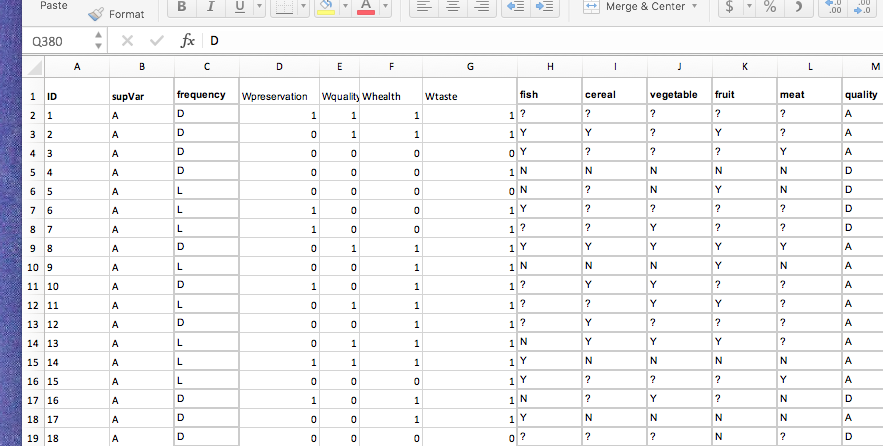

```{r, eval = TRUE, ECHO = FALSE , include = FALSE}
knitr::opts_chunk$set(collapse = TRUE, fig.width = 9, comment = "#>")
#knitr::opts_chunk$set(fig.path = '../test4Spise2018/lesFigs4Ferment/') 
#knitr::opts_chunk$set(tex.path = '../test4Spise2018/lesFigs4Ferment/') 
# Knitr options here
knitr::opts_knit$get()
```


```{r pdfIt, echo = FALSE, warning = FALSE, eval = FALSE}
# This code can be used to generate pdf or words
rmarkdown::render('../test4Spise2018/fermentationMCA.Rmd',
                   c('bookdown::pdf_document2','bookdown::html_document2') ) ,
                   intermediates_dir = '../test4Spise2018/stuff4Ferment/')
rmarkdown::render('../test4Spise2018/fermentationMCA.Rmd',
                   c('bookdown::pdf_document2','bookdown::html_document2'),
                   output_dir = '../test4Spise2018/stuff4Ferment/')
# Previous command cannot pass options such as keep_tex
# to do so run only on format at a time such as:
rmarkdown::render("fermentationIn2NationsMCA.Rmd",
                   bookdown::pdf_document2(keep_tex = TRUE, 
                   toc_depth = 3)  ,
                   output_dir = '../../test4Spise2018/stuff4Ferment/')
# rmarkdown::render('../test4Spise2018/fermentationMCA.Rmd','tufte::tufte_html')
# Not tufte works only with 2 levels of section
# rmarkdown::render('../test4Spise2018/fermentationMCA.Rmd',tufte::tufte_handout(toc_depth = 2))
# rmarkdown::render('../test4Spise2018/fermentationMCA.Rmd','html_notebook')
# better
# xaringan::inf_mr()
# pretty format
rmarkdown::render('../test4Spise2018/fermentationMCA.Rmd',
                   prettydoc::html_pretty(keep_tex = "hpstr", 
                   toc_depth = 3) )
rmarkdown::render('../test4Spise2018/fermentationMCA.Rmd',
                   rmdformats::html_clean(keep_tex = TRUE 
                    ) )
```

# Prelude

If you want to make sure that you have a clean start,
you can execute the following commands:
```{r , include = TRUE, echo = TRUE}
rm(list = ls())
graphics.off()
```
Or, better (see below, preamble), you can use an `Rproject` for this project.

```{r setup, include = FALSE, ECHO = FALSE}
# Important: Remember 
#     build the vignettes with devtools::build_vignettes()
knitr::opts_chunk$set(
  collapse = TRUE,
  comment = "#>",
  fig.height = 9,
  fig.width =  8
)
```

```{r, eval = FALSE,ECHO = FALSE , include = FALSE}
knitr::opts_knit$get()
```

# Preamble

Make sure that your start this analysis a new `Rproject` so that
the default directory will be correctly set.

Before we start the analysis,
we need to have our standard packages installed (some from `Github`) 
and the corresponding libraries loaded:

* `Distatis`
* `ExPosition`
* `InPosition`
* `PTCA4CTA`
* `R4SPISE2018`
* `data4PCCAR`
* `dplyr` (to recode the data)
* `car`   (to recode the data)
* `grid`, `gridExtra`, and `gTable` 
(to save tables as graphics, useful for power points)
* `stringi` (to recode strings)

and all their extensions:
```{r loadPackages}
# Decomment all/some these lines if the packages are not installed
#_____________________________________________________________________
# # October 19, 2018. Temporary fix for an Rstudio problem
# # if this error is generated 
# build_site()
# Error in eval(substitute(expr), data, enclos = parent.frame()) :
# is.character(repos) is not TRUE
# # from Rstudio team: use these two lines
# repos <- getOption("repos")
# options(repos = setNames(as.character(repos), names(repos)))
#_____________________________________________________________________
#
# devtools::install_github('HerveAbdi/PTCA4CATA')
# devtools::install_github('HerveAbdi/DistatisR')
# devtools::install_github('HerveAbdi/data4PCCAR')
# devtools::install_github('HerveAbdi/R4SPISE2018') # of course!
#  install.packages('prettyGraphs')
#  install.packages('Matrix')
#  install.packages('dplyr')
#  install.packages('gridExtra')
#  install.packages('grid')
#  install.packages('gtable')
#  install.packages('stringi')
#  install.packages('printr')
#  install.packages('kableExtra')
#  load the libraries that we will need
suppressMessages(library(Matrix))
suppressMessages(library(prettyGraphs))
suppressMessages(library(ExPosition))
suppressMessages(library(InPosition))
suppressMessages(library(DistatisR))
suppressMessages(library(PTCA4CATA))
suppressMessages(library(data4PCCAR))
suppressMessages(library(dplyr))
suppressMessages(library(gridExtra))    # to save a table as a graph
suppressMessages(library(grid))         # that will be saved in the
suppressMessages(library(gtable))       # powerpoint with the figures
# suppressMessages(library(printr))     # To pretty print tables 
# suppressMessages(library(kableExtra)) # To pretty print tables 

```

# Introduction

##  File name for the power point to save the figures

The name for the power point is stored as

```{r name4pptx}
name4Graphs = 'fermentationFrom2Countries.pptx'
```

## Parameters for the analysis: data file name

The data are stored in an excel file 
called 'fermentedFoodSurvey.xlsx' that is stored with the package and
whose path can be recovered as:
```{r filename, eval = TRUE}
file2read.name     <- 'fermentedFoodSurvey.xlsx' # xls data file name
path2file <- system.file("extdata", file2read.name, package = "R4SPISE2018")
```
In the xls-file `r file2read.name`, the data are stored
in the sheet called `dataMCA` whose name is stored
in the variable `sheetName4Data`:
```{r sheetName}
sheetName4Data     <- 'dataMCA' # sheet name for the data
```

### A peek at the data

The excel data file looks like the figure below:

```{r xls.datafile, echo=FALSE, fig.cap="The Data Excel File \\label{fig:spicesxl}", fig.height=3, fig.width=4, include=TRUE, out.width='70%'}



```

### To replicate with different data

When you record you own data,
make sure that you follow the same format, this way, the script
described in this vignette will apply 
to your own analysis with minimal changes.

### The general analytic strategy

We will first compute the results of the analysis, then create 
the graphics, and finally save everything into a PowerPoint.

# Run the statistical analysis

## Read the (active and supplementary) data

The excel file name and location (i.e., path) are
stored in the variable `path2file`. 
To read the data we will use the function
`DistatisR::read.df.excel()` (based upon
the function `readxl::read_excel()`).
```{r resdSortingData}
rawData.tmp <- DistatisR::read.df.excel(path = path2file, 
                             sheet = sheetName4Data)$df.data
# 
```

The raw data are now read and stored in the
data frame `rawData.tmp`.
For these data to be used in an MCA, they need 
to be transformed into `factors` and stored in
the data frame called `rawData`.

```{r }
# Transform the data into factors
rawData <- apply(rawData.tmp,2,as.factor)
```

## Look at the data

The first thing in a survey is to look at the data
and to select the questions that create enough differences between 
the respondents.
A quick and dirty way top look at the data is to use the
function `summary().`

```{r summary}
 knitr::kable( t( summary(rawData) ) )
```

From the summary, we see that most questions have two possible
answers and that a few of them have three possible answers.

### A bit more on the variables

The three variables starting with `W` were responses to
the question *What makes you want to buy a fermented product?*
These variables were coded as `1` if checked and `0` if not.
The variables `fish` to `meat` were answers to the question 
`Fermentation is well suited for ...:` 
(3 responses were possible: `Yes`,
`No`, and `Do not know`). 
The variables `quality` to `clear` were Likert scales 
(answers from 1 to 4) about statements on fermentation;
These Likert scales were recoded as  `A` (agree) and
`D` (disagree). 

The following set of variables  corresponds to the demographics of the
participants:
`Sex`, coded as `M` vs `W`;
`Age`, coded as less then 25 (`<25`) and
more than 25 (`>25`); 
Occupation binarized as "Food or microbiology" (`FM`)
versus `other` and 
Nationality (`nation`) code with two levels French (`F`) versus
Vietnamese (`VN`). 

To know more about the questions, you can have a look at 
the questionnaire `questionnaireFermentation.pdf` that you can find
in the directory that you can recover 
from the variable `path2file`.

## Analysis plan

The data were previously "cleaned" so that
we only kept
questions that created differences
between the respondents.

### Supplementary Variables


Here we decided to treat
as supplemtary variables 
the demographics of the respondents:
Sex `(sex)`, Age `(age)`, `occupation` and 
their country of residence `(nation)`.


## Selection and recoding

In MCA, the data need to be recoded as nominal variables
with the constraint that the different levels of a given variable
are roughly balanced.
When all the variables are naturally nominal, the process is 
straightforward but some categories may need to be fused
to have the levels roughly balanced.
For ordinal or quantitative data, the procedure is to bin
the data so that the bins are roughly balanced.

## From one dataframe to the other

From the dataframe `rawData` we now create
the new dataframe `cleanData`. It will have the 
same rows but the columns are obtained by recoding 
the columns of `rawData.`

The first step is to create the new data frame with 
only the variables we want to use, we also re-order the variables
to have the respondent variables (i.e., Sex, Age, city) first.
This is done with this line of code:
```{r maketmpData}
temp.df <- dplyr::select(as.data.frame(rawData), 
                         supVar,
                         sex , age, occupation, nation, frequency, 
                         Wpreservation, Wquality, Whealth, Wtaste, 
                         fish, cereal,  vegetable, fruit, meat,
                         quality, industrial, preservation, health,  
                         expensive, taste, trust, clear, innovation)
```

Note that here, for a first pass, we keep all variables:


### Participants' description

to make the results and graphs more readable,
we recode 
the levels of some variables to  shorter names

```{r recodeAge}
temp.df[,'age'] <- plyr::mapvalues(temp.df[,'age'], 
                          from = c("<25", ">25"), to = c("Y", "O"))
temp.df[,'occupation'] <- plyr::mapvalues(temp.df[,'occupation'], 
                          from = c("FM", "other"), to = c("F", "O"))
temp.df[,'nation'] <- plyr::mapvalues(temp.df[,'nation'], 
                          from = c("F", "VN"), to = c("F", "V"))
```

### New cleaned data set(s)

We can now put together the new data set.
Note that in this example the supplementary observations
were stored in the same excel sheet as the active data
but the supplementary observations' names all start the letter `S`.
The status of the observations (i.e., active vs. supplementary)
is recorded in the variable `supVar` that we will use to subset
the observations into the active set 
(stored in the data frame `cleanData`) and
the supplementary set 
(stored in the data frame `cleanData.sup`).

```{r cleanData}
cleanData.tmp <- temp.df
cleanData.tmp <- cleanData.tmp[complete.cases(cleanData.tmp),]
cleanData.allVar <- cleanData.tmp[cleanData.tmp[,1] == 'A', 2:ncol(cleanData.tmp)]
cleanData.varSup <- cleanData.allVar[,1:4]
cleanData        <- cleanData.allVar[,5:ncol(cleanData.allVar)]
cleanData.sup <- cleanData.tmp[cleanData.tmp[,1] == 'S', 6:ncol(cleanData.tmp)]
```

The different dataframes are now ready to be analyzed 
with multiple correspondence analysis:
* `cleanData` contains the active observations and variables,
* `cleanData.sup` contains the supplementary observations,
* `cleanData.varSup` contains the supplemtary variables.

# Multiple Correspondence Analysis

## MCA for the active set

We use the package `ExPosition` to compute the MCA
```{r runMCA}
resMCA <- epMCA(cleanData, graphs = FALSE) 
```
## Supplementary observations

To compute the supplementary projections, we use the 
function `ExPosition::supplementaryRows()`. 
But before using this function,
we need to prepare the supplementary data.
To do so, we need to
transform the supplementary data from a data frame with
variables being factors to a new data frame with 0/1 variables 
(with as many
0/1 variables as there are levels for this variable).
For this transformation to be correctly done, it needs to be
done on the merged data set (i.e., active + supplementary).
All this is done with the code below

```{r runMCA.sup}
# recode the factors as set of 0/1 variables
testclean <- makeNominalData(rbind(cleanData,cleanData.sup))
clean.Sup <-  testclean[cleanData.tmp[,1] == 'S',]
# barycentric code for nation
#clean.Sup[,(colnames(testclean) %in% 'nation.F')] <- .5
#clean.Sup[,(colnames(testclean) %in% 'nation.V')] <- .5
#
resMCA.sup <- supplementaryRows(SUP.DATA = clean.Sup, res = resMCA)
colnames(resMCA.sup$fii) <- paste0('Dimension ',
                                1:ncol(resMCA.sup$fii))
```

## Supplementary variables.

```{r runMCA.varsup}
#
resMCA.varSup <- supplementaryCols(SUP.DATA = makeNominalData(cleanData.varSup),
                                        res = resMCA)
colnames(resMCA.varSup$fjj) <- paste0('Dimension ',
                                1:ncol(resMCA.varSup$fjj))
```

## Inferences

Inferences are performed with the package `InPosition`

```{r inferences, message = FALSE, warning = FALSE, results= FALSE}
resMCA.inf <- epMCA.inference.battery(cleanData, graphs = FALSE)
```
# Graphics

Here we make the standard graphs for the active variables and observations, 
and then for the supplementary observations

## Get some colors for the variables

```{r colors}
cJ <- resMCA$ExPosition.Data$cj
color4Var <- prettyGraphs::prettyGraphsColorSelection(ncol(cleanData))
```
## Heatmap for the correlations between qualitative variables


The equivalent of a correlation matrix can be obtained in MCA
by computing the $\phi^2$ correlation matrix associated to
the Burt-table derived from the 0/1 matrix.
This is obtained from the following code:
```{r phi2}
# Pseudo Heat Map. Correlation ----
# We need correlation to compare with PCA
corrMatBurt.list <- phi2Mat4BurtTable(cleanData)
col <- colorRampPalette(c("#BB4444", "#EE9988", "#FFFFFF", "#77AADD", "#4477AA"))

corr4MCA.r <- corrplot::corrplot(
         as.matrix(corrMatBurt.list$phi2.mat^(1/2)), 
         method="color", col=col(200),  
         type="upper", 
         addCoef.col = "black", # Add coefficient of correlation
         tl.col = color4Var, 
         tl.cex = .9,
         tl.srt = 45, #Text label color and rotation
         number.cex = .8,
         diag = TRUE # needed to have the color of variables correct
         )
# dev.new()
a0000.corMat.phi <- recordPlot()
```


## Variable contributions

The contributions for the variables can be obtained from the function
`data4PCCAR::ctr4Variables` as:
```{r ctrVar}
varCtr <- data4PCCAR::ctr4Variables(cJ) 
rownames(color4Var) <- rownames(varCtr)
```


The contribution of a variable is the sum of the contributions 
of all its levels, this parameter 
measures the importance of this variable
 for
a given dimension. 

```{r ctrVar.Tab}
nFact <- min(5, ncol(cJ) - 1)
#knitr::kable(round( varCtr[,1:nFact]*1000 ) )
# save table as a graph
ctrTable <- tableGrob(round(varCtr[,1:nFact]*1000))
h <- grobHeight(ctrTable)
w <- grobWidth(ctrTable)
title <- textGrob("Variable Contributions",
                 y = unit(0.5,"npc") + 0.92*h, 
                 # fine tune the position of the title 
                  just = "centre",
                  gp = gpar(fontsize = 14))
TableWithTitle <- gTree(children = gList(ctrTable, title))
```


```{r , fig.height= 10, fig.width= 6, fig.cap = 'Variable Contributions (per mille). \\label{fig:varCtr}', collapse = TRUE, fig.margin = TRUE}
# Note: Potential problems with grid.draw(). If it does not plot
# recordPlot() will fail and the graph will not be saved in the powerpoint
# and will generate a strange error message
grid.draw(TableWithTitle)
#a0000.2.ctrTable  <- recordPlot()
```


```{r printr,  echo = FALSE, message = FALSE }
# As an alternative we print the contributions with a combination
#of `kable` and `printr` as:
laTable <- round(varCtr[,1:nFact]*1000)
# knitr::kable(round(varCtr[,1:nFact]*1000), caption = 'Variable Contributions')
#    %>%
#   kable_styling(latex_options = c("striped", "hold_position"), full_width = F) %>%
#  add_header_above(c(" ", "Dimensions" = nFact))
  
```


To create graphics we will 
color the different labels of a variable with the same color.
First we create the vector storing the color with the function
`data4PCCAR::coloringLevels`:
```{r color4Levels}
col4Levels <- data4PCCAR::coloringLevels(
                       rownames(resMCA$ExPosition.Data$fj), color4Var)
col4Labels <- col4Levels$color4Levels
```


As an alternative to the table of contributions,
we can display the contributions with some bar plots.
Note that these bar plots need some "tweaking" to correctly
works.

### Variable contributions Dimension 1.

```{r ctrV1}
varCtr1 <- varCtr[,1]
names(varCtr1) <- rownames(varCtr)
a0005.Var.ctr1  <- PrettyBarPlot2(varCtr1,
                    main = 'Variable Contributions: Dimension 1',
                                ylim = c(-.05, 1.2*max(varCtr1)),
                                font.size = 5,
                                threshold = 1 / nrow(varCtr),
                                color4bar = gplots::col2hex(color4Var)
)
print(a0005.Var.ctr1)
```

### Variable contributions Dimension 2.


```{r ctrV2}
varCtr2 <- varCtr[,2]
names(varCtr2) <- rownames(varCtr)
a0006.Var.ctr2  <- PrettyBarPlot2(varCtr2,
                    main = 'Variable Contributions: Dimension 2',
                                ylim = c(-.05, 1.2*max(varCtr2)),
                                threshold = 1 / nrow(varCtr),
                                font.size = 5,
                                color4bar = gplots::col2hex(color4Var)
)
print(a0006.Var.ctr2)
```

### Variable contributions Dimension 3.


```{r ctrV3}
varCtr3 <- varCtr[,3]
names(varCtr3) <- rownames(varCtr)
a0006.Var.ctr3  <- PrettyBarPlot2(varCtr3,
                    main = 'Variable Contributions: Dimension 3',
                                ylim = c(-.05, 1.2*max(varCtr2)),
                                threshold = 1 / nrow(varCtr),
                                font.size = 5,
                                color4bar = gplots::col2hex(color4Var)
)
print(a0006.Var.ctr3)
```


#### Pseudo factor plots with variable contributions

Another way to visualize the variable contributions is
to use a pseudo-factor plot with the contributions:

```{r ctrV12}
ctrV12 <- PTCA4CATA::createFactorMap(X =  varCtr, 
                        title = "Variable Contributions", 
                        col.points = color4Var,
                        col.labels = color4Var,
                        alpha.points = 0.5,
                        cex = 2.5, 
                        alpha.labels = 1, 
                        text.cex = 4,
                        font.face = "plain", 
                        font.family = "sans")

ctr.labels <- createxyLabels.gen(
  1,2, lambda = resMCA$ExPosition.Data$eigs,
  tau = resMCA$ExPosition.Data$t
)
a0007.Var.ctr12  <- ctrV12$zeMap  + ctr.labels
#
print(a0007.Var.ctr12)

```
### Add a contribution plot with important variables only

```{r getCtr12}
absCtrVar <- as.matrix(varCtr) %*% diag(resMCA$ExPosition.Data$eigs)
varCtr12  <- (absCtrVar[,1] + absCtrVar[,2]) / 
   (resMCA$ExPosition.Data$eigs[1] + resMCA$ExPosition.Data$eigs[2])
importantVar <- (varCtr12 >=  1 / length(varCtr12))
col4ImportantVar <- color4Var
col4NS <- 'gray90' 
col4ImportantVar[!importantVar] <- col4NS
```


```{r ctrV12.ns}
ctrV12.imp <- PTCA4CATA::createFactorMap(X =  varCtr, 
                        title = "Important Variables: Contributions", 
                        col.points = col4ImportantVar,
                        col.labels = col4ImportantVar,
                        alpha.points = 0.5,
                        cex = 2.5, 
                        alpha.labels = 1, 
                        text.cex = 4,
                        font.face = "plain", 
                        font.family = "sans")
a0008.Var.ctr12.imp  <- ctrV12.imp$zeMap  + ctr.labels
#
print(a0008.Var.ctr12.imp)

```


#### A map with Dimension 2 & 3


```{r getCtr23}
#absCtrVar <- as.matrix(varCtr) %*% diag(resMCA$ExPosition.Data$eigs)
varCtr23  <- (absCtrVar[,3] + absCtrVar[,2]) / 
   (resMCA$ExPosition.Data$eigs[3] + resMCA$ExPosition.Data$eigs[2])
importantVar23 <- (varCtr23 >=  1 / length(varCtr23))
col4ImportantVar23 <- color4Var
col4NS <- 'gray90' 
col4ImportantVar23[!importantVar23] <- col4NS
```


```{r ctrV23.ns}
ctrV23.imp <- PTCA4CATA::createFactorMap(X =  varCtr,
                                         axis1 = 3, axis2 = 2,
                        title = "Important Variables: Contributions 3 * 2", 
                        col.points = col4ImportantVar23,
                        col.labels = col4ImportantVar23,
                        alpha.points = 0.5,
                        cex = 2.5, 
                        alpha.labels = 1, 
                        text.cex = 4,
                        font.face = "plain", 
                        font.family = "sans")
ctr.labels23 <- createxyLabels.gen(
  3,2, lambda = resMCA$ExPosition.Data$eigs,
  tau = resMCA$ExPosition.Data$t
)
a0009.Var.ctr23.imp  <- ctrV23.imp$zeMap  + ctr.labels23
#
print(a0009.Var.ctr23.imp)

```

## Scree for MCA


### Plain Scree

```{r screeMCA, fig.height=4, fig.width= 7, }
scree.mca <- PlotScree(ev = resMCA$ExPosition.Data$eigs, 
                    title = "MCA. Explained Variance per Dimension")
b0001a.Scree <- recordPlot() # Save the plot
```

### Scree with inference

```{r screeMCA.inf, fig.height=4, fig.width= 7, }
scree.mca <- PlotScree(ev = resMCA$ExPosition.Data$eigs, 
               p.ev = resMCA.inf$Inference.Data$components$p.vals, 
               plotKaiser = TRUE,
               title = "MCA. Explained Variance per Dimension")
b0001b.Scree <- recordPlot() # Save the plot
```

## Variable Map

```{r createFjMap}
axis1 = 1
axis2 = 2
Fj <- resMCA$ExPosition.Data$fj
# generate the set of maps
BaseMap.Fj <- createFactorMap(X = Fj , # resMCA$ExPosition.Data$fj,
                              axis1 = axis1, axis2 = axis2,
                              title = 'MCA. Variables', 
                              col.points = col4Labels, cex = 1,
                              col.labels = col4Labels, text.cex = 2.5,
                              force = 2)
# add labels
labels4MCA <- createxyLabels.gen(x_axis = axis1, y_axis = axis2,
               lambda = resMCA$ExPosition.Data$eigs,
               tau = resMCA$ExPosition.Data$t)
# make the maps
b0002.BaseMap.Fj <- BaseMap.Fj$zeMap + labels4MCA 
b0003.BaseMapNoDot.Fj  <- BaseMap.Fj$zeMap_background +
                          BaseMap.Fj$zeMap_text + labels4MCA 
```

```{r plotaMap, fig.width= 8 , fig_width = '100%'}
print(b0002.BaseMap.Fj)
```

### Variable Map with only important variables


```{r mapJ-grey}
col4Levels.imp <- data4PCCAR::coloringLevels(rownames(Fj),
                                             col4ImportantVar)
BaseMap.Fj.imp <- createFactorMap(X = Fj , # resMCA$ExPosition.Data$fj,
                              axis1 = axis1, axis2 = axis2,
                              title = 'MCA. Important Variables', 
                      col.points = col4Levels.imp$color4Levels, 
                              cex = 1,
                      col.labels = col4Levels.imp$color4Levels, 
                              text.cex = 2.5,
                              force = 2)
b0010.BaseMap.Fj <- BaseMap.Fj.imp$zeMap + labels4MCA 
print(b0010.BaseMap.Fj)
```


### Map with important variables and lines

The MCA map for the variables is easier to read when the 
levels of the qualitative variables are linked to each other with
lines as show below

```{r adLines}
lines4J <- addLines4MCA(Fj, col4Var = col4Levels.imp$color4Variables, size = .7)
 b0020.BaseMap.Fj <-  b0010.BaseMap.Fj + lines4J
 print( b0020.BaseMap.Fj)
```


```{r someLines}
zeNames          <- getVarNames(rownames(Fj)) 
importantsLabels <- zeNames$stripedNames %in% zeNames$variableNames[importantVar]
Fj.imp <- Fj[importantsLabels,]
lines4J.imp <- addLines4MCA(Fj.imp, 
                            col4Var = col4Levels$color4Variables[which(importantVar)], 
                            size = .9, linetype = 3, alpha = .5)
 b0021.BaseMap.Fj <-  b0020.BaseMap.Fj + lines4J.imp
 print( b0021.BaseMap.Fj)
```


### Map with important variables and lines for Dimensions 2 & 3

Have a look at the map for Dimensions 2 and 3.


### Maps with important and supplementary variables

To facilitate the interpretations of the map,
we can add the supplementary variables to the variable map,
as shown below:

```{r mapvarSup}
col4VarSup <- prettyGraphs::prettyGraphsColorSelection(ncol(cleanData.varSup))
Fj.sup <- resMCA.varSup$fjj
col4Levels.sup <- data4PCCAR::coloringLevels(rownames(Fj.sup), col4VarSup)
BaseMap.Fj.sup <- createFactorMap(X = Fj.sup , # resMCA$ExPosition.Data$fj,
                axis1 = axis1, axis2 = axis2,
                constraints  = BaseMap.Fj$constraints, # to get same size
                title = 'MCA. Supplementary and Important Variables', 
                col.points = col4Levels.sup$color4Levels, 
                              cex = 1,
                col.labels = col4Levels.sup$color4Levels, 
                text.cex = 2.5,
                force = 2)
lines4J.sup <- addLines4MCA(Fj.sup, 
                  col4Var = col4Levels.sup$color4Variables, size = .7)
b0030.Sup.Fj <- BaseMap.Fj.sup$zeMap + 
                     BaseMap.Fj.imp$zeMap_dots + 
                     BaseMap.Fj.imp$zeMap_text +
                     labels4MCA + 
                     lines4J + lines4J.sup
print(b0030.Sup.Fj)
```

This last map can easier to read if we plot only the supplementary 
variables.

```{r mapvarSup.only}
b0031.Sup.Fj.only <- BaseMap.Fj.sup$zeMap + 
                     BaseMap.Fj.imp$zeMap_dots + 
                     labels4MCA + 
                      lines4J.sup
print(b0031.Sup.Fj.only)
```


The plots of the supplementary variables suggest that
Dimension 1 expresses a difference between young, (often food professionals), 
Vietnamese respondents versus older, (mostly non food professional), 
French respondents 
(a pattern indicating a potential confound of the `age` and
`nation` variables).
We will explore this difference between Vietnamese 
and French respondents by coloring,
in their maps, the respondents according to their nationality.
 

### Bootstrap ratios

Just like in PCA, the significance of
each column (i.e., level of a qualitative variable) can be assessed
with a bootstrap ratio.
For example, the bootstrap ratios for all levels of all
qualitative variables for Dimension 1 are plotted as

```{r BR1}

c0001.Levels.BR  <- PrettyBarPlot2(
      resMCA.inf$Inference.Data$fj.boots$tests$boot.ratios[,1], # BR
                    main = 'Bootstrap Ratios for Columns : Dimension 1',
                             threshold = 2,
                             color4bar = gplots::col2hex(col4Labels)
)
print(c0001.Levels.BR)
```


### Qualitative variables pseudo-*F*

If we assume
that all levels of the variable are balanced,
pseudo-$F$ ratios 
for the $K$ qualitative variables
can also be obtained from the bootstrap ratios 
with the formula:
 $$F_j = \frac{J_k}{J_k-1} \sum_{j}^{J_k} t_{k}^2$$ 
where $J_k$ (respectively $t_k$) is the number of levels 
(respectively bootstrap ratio)
for the $k$-th qualitative variable.

If we want to take into account the frequency of the different
levels of a qualitative variable, and
if we denote by $w_{j(k)}$ the frequency of level $j$ of the
$k$-th variable, the pseudo-$F$ ratios can be computed as:
$$F_k = \frac{1}{J_k-1} \sum_{j}^{J_k} w_{j(k)} t^2.$$

These pseudo-$F$ ratios 
evaluates if a dimension of the MCA creates  a reliable 
difference between the levels of a qualitative variable;
by contrast, a column bootstrap ratio evaluates 
if this column systematically loads on the same side of
a given dimension.

```{r BR4var}
# Get the pseudo Bootstrap Rqtios
BrLevels <- resMCA.inf$Inference.Data$fj.boots$tests$boot.ratios
wJ       <- 1 / resMCA.inf$Fixed.Data$ExPosition.Data$W
nIter    <- 1000
Br4Variables <- data4PCCAR::BR4varMCA(BrLevels, wJ, nIter) 
```

#### Pseudo-BR Dimension 1


```{r BR41}
VarBR1 <- Br4Variables$pseudoBR.pos[,1]
c0010.Var.br1  <- PrettyBarPlot2(VarBR1,
                    main = 'Variable Pseudo Bootstrap Ratios: Dimension 1',
                               ylim = 2,
                                threshold = 2,
                                font.size = 5,
                                color4bar = gplots::col2hex(color4Var)
)
print(c0010.Var.br1)
```

#### Pseudo-BR Dimension 2


```{r BR42}
VarBR2 <- Br4Variables$pseudoBR.pos[,2]
c0011.Var.br2  <- PrettyBarPlot2(VarBR2,
                    main = 'Variable Pseudo Bootstrap Ratios: Dimension 2',
                               ylim = 2,
                                threshold = 2,
                                font.size = 5,
                                color4bar = gplots::col2hex(color4Var)
)
print(c0011.Var.br2)
```

#### Pseudo-BR Dimension 3


```{r BR43}
VarBR3 <- Br4Variables$pseudoBR.pos[,3]
c0012.Var.br3  <- PrettyBarPlot2(VarBR3,
                    main = 'Variable Pseudo Bootstrap Ratios: Dimension 3',
                               ylim = 2,
                               threshold = 2,
                               font.size = 5,
                               color4bar = gplots::col2hex(color4Var)
)
print(c0012.Var.br3)
```

### Pseudo-Bootstrapped Map for Levels of Variables

In a similar way to the graphs of the Levels of the qualitative
variables based on contributions we can also plot 
 graphs of the Levels of the qualitative
variables based on the bootstrap ratios,
These will look very similar, with the exception of the variable 
`occupation`, which has an important contribution but a 
non-significant pseudo bootstrap ratio.

## Map for the observations

Here we  color the observations by `nation,` 
to better understand how this variable 
could explain some of the  variability in for this data set
(the projection of `nation` as a supplementary variable
was already suggesting that this variable is realted to Dimension 1).

```{r createFiMap}
Fi <- resMCA$ExPosition.Data$fi
colCity <- c('darkblue', 'red4')
nI <- nrow(Fi)
col4I.City <- rep("",nI)

for (i in 1:length(colCity) ){
  lindex <- cleanData.allVar[,'nation'] %in% unique(cleanData.allVar[,'nation'])[i]
  col4I.City[lindex] <- colCity[i]
}
# generate the set of maps
BaseMap.Fi <- createFactorMap(X = Fi , # resMCA$ExPosition.Data$fj,
                              axis1 = axis1, axis2 = axis2,
                              title = 'MCA. Observations (by nation)', 
                              col.points = col4I.City,
                              alpha.points = .4, cex = .9,
                              col.labels = col4I.City,
                              text.cex = 2.5, 
                              force = 2)
# make the maps
d0001.BaseMapNoLabels.Fi  <- BaseMap.Fi$zeMap_background +
                                  BaseMap.Fi$zeMap_dots + labels4MCA 
```

```{r plotaMapi, fig.width= 8 }
print(d0001.BaseMapNoLabels.Fi)
```

## Add Group Means, Confidence, and Tolerance Intervals


### Group Means

```{r Boot4CI}
# Bootstrap for CI:
BootCube.Gr <- PTCA4CATA::Boot4Mean(resMCA$ExPosition.Data$fi, 
                                 design = cleanData.allVar$nation,
                                 niter = 100,
                                 suppressProgressBar = TRUE)
nationsMeans <- PTCA4CATA::getMeans(resMCA$ExPosition.Data$fi, cleanData.allVar$nation)
# colCity <- c('darkblue', 'red4')
MapGroup <- PTCA4CATA::createFactorMap(nationsMeans,
                            # use the constraint from the main map
                            constraints = BaseMap.Fi$constraints,
                            col.points = colCity,
                            cex = 7,  # size of the dot (bigger)
                            col.labels = colCity,
                            text.cex = 6)
d002.Map.I.withMeans <- d0001.BaseMapNoLabels.Fi  +
                          MapGroup$zeMap_dots + MapGroup$zeMap_text
print(d002.Map.I.withMeans)
```

### With bootstrapped confidence intervals 

```{r graphElli}
GraphElli <- PTCA4CATA::MakeCIEllipses(BootCube.Gr$BootCube[,1:2,],
                            names.of.factors = c("Dimension 1","Dimension 2"),
                            col = colCity,
                            p.level = .95)
d003.Map.I.withCI <-  d0001.BaseMapNoLabels.Fi + 
                          MapGroup$zeMap_text +  GraphElli
print(d003.Map.I.withCI)
```

### With Tolerance convex hulls

```{r TI}
GraphTI.Hull <- PTCA4CATA::MakeToleranceIntervals(resMCA$ExPosition.Data$fi,
                            design = as.factor(cleanData.allVar$nation),
                            # line below is needed
                            names.of.factors =  c("Dim1","Dim2"), # needed 
                            col = colCity,
                            line.size = .50, 
                            line.type = 3,
                            alpha.ellipse = .2,
                            alpha.line    = .4,
                            p.level       = .75)
#_____________________________________________________________________
# Create the map:
d005.Map.I.withTIHull <- d002.Map.I.withMeans  +
                           GraphTI.Hull + MapGroup$zeMap_dots +
                           MapGroup$zeMap_text + MapGroup$zeMap_dots
#_____________________________________________________________________
# plot it
# dev.new()
print(d005.Map.I.withTIHull)
```

## Projecting a subsample

Here we project in the observation sapce the data
obtained from the 30 participants of the `SPISE2018`
(for these participants, if you remember your ID number
you can find out where you are ...).

```{r createFiMap.sup}
Fi.sup  <- resMCA.sup$fii
col     <- 'green'  
nI.sup <- nrow(Fi.sup)
col4I.sup <- rep("",nI.sup)
# generate the set of maps
BaseMap.Fi.sup <- createFactorMap(X = Fi.sup , # resMCA$ExPosition.Data$fj,
                              axis1 = axis1, axis2 = axis2,
                              constraints = BaseMap.Fi$constraints,
                              title = '', 
                              col.points = 'green',
                              alpha.points = .2, cex = 1.2,
                              col.labels = 'green',
                              text.cex = 2.5,
                              force = 2)
# make the maps
e0001.BaseMapNoLabels.Fi.sup  <- BaseMap.Fi$zeMap_background +
                                   BaseMap.Fi.sup$zeMap_dots + 
                                   BaseMap.Fi.sup$zeMap_text + 
                                   BaseMap.Fi$zeMap_dots +
  ggplot2::ggtitle('MCA Active and Supplementary Observations') +
                                   labels4MCA 
```

```{r plotaMapi.sup, fig.width= 8 }
 print(e0001.BaseMapNoLabels.Fi.sup)
```

Not surpringly, the participants of the SPISE2018 meeting
are projected close to the Vietnamese participants.

# Save the graphics as a PowerPoint

The graphics are saved as a powerpoint presentation called
``r name4Graphs``
with the following command


```{r saveGraphs, message = FALSE, warning = FALSE, error = FALSE, eval = FALSE}
list2Graphs <- PTCA4CATA::saveGraph2pptx(file2Save.pptx = name4Graphs, 
                 title = 'Attitudes toward fermented products', 
                 addGraphNames = TRUE)
```


Note that we could also have created a power point with
`Rmarkdown` by using the following options in the 
preamble:

```{r powerpoint,  message = FALSE, warning = FALSE, error = FALSE, eval = FALSE}
output:
      powerpoint_presentation:
           slide_level: 4
```

instead of (for example):

```{r vignettes,  message = FALSE, warning = FALSE, error = FALSE, eval = FALSE}
output:
       rmarkdown::html_vignette:
          toc: true
          number_sections: true
```          
