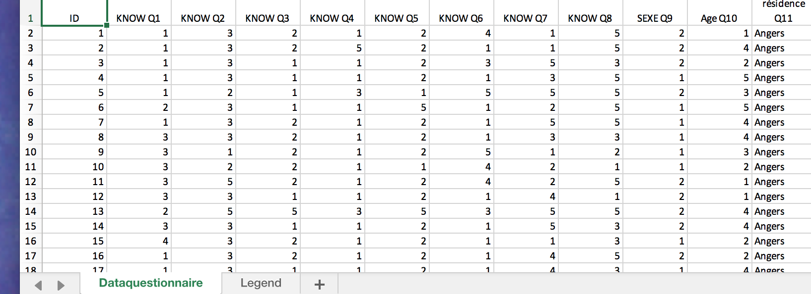

```{r, eval = TRUE, ECHO = FALSE , include = FALSE}
knitr::opts_chunk$set(collapse = TRUE, fig.width = 9, comment = "#>")
#knitr::opts_chunk$set(fig.path = '../test4Spise2018/lesFigs4Ferment/') 
#knitr::opts_chunk$set(tex.path = '../test4Spise2018/lesFigs4Ferment/') 
# Knitr options here
knitr::opts_knit$get()
```


```{r pdfIt, echo = FALSE, warning = FALSE, eval = FALSE}
# This code can be used to generate pdf or words
rmarkdown::render('../test4Spise2018/fermentationMCA.Rmd',
                   c('bookdown::pdf_document2','bookdown::html_document2') ) ,
                   intermediates_dir = '../test4Spise2018/stuff4Ferment/')
rmarkdown::render('../test4Spise2018/fermentationMCA.Rmd',
                   c('bookdown::pdf_document2','bookdown::html_document2'),
                   output_dir = '../test4Spise2018/stuff4Ferment/')
# Previous command cannot pass options such as keep_tex
# to do so run only on format at a time such as:
rmarkdown::render('../test4Spise2018/fermentationMCA.Rmd',
                   bookdown::pdf_document2(keep_tex = TRUE, 
                   toc_depth = 3) ,
                   output_dir = '../test4Spise2018/stuff4Ferment/')
# rmarkdown::render('../test4Spise2018/fermentationMCA.Rmd','tufte::tufte_html')
# Not tufte works only with 2 levels of section
# rmarkdown::render('../test4Spise2018/fermentationMCA.Rmd',tufte::tufte_handout(toc_depth = 2))
# rmarkdown::render('../test4Spise2018/fermentationMCA.Rmd','html_notebook')
# better
# xaringan::inf_mr()
# pretty format
rmarkdown::render('../test4Spise2018/fermentationMCA.Rmd',
                   prettydoc::html_pretty(keep_tex = "hpstr", 
                   toc_depth = 3) )
rmarkdown::render('../test4Spise2018/fermentationMCA.Rmd',
                   rmdformats::html_clean(keep_tex = TRUE 
                    ) )
```

# Prelude

If you want to make sure that you have a clean start,
you can execute the following commands:
```{r , include = TRUE, echo = TRUE}
rm(list = ls())
graphics.off()
```
Or, better (see below, preamble), you can use an `Rproject` for this project.

```{r setup, include = FALSE, ECHO = FALSE}
# Important: Remember 
#     build the vignettes with devtools::build_vignettes()
knitr::opts_chunk$set(
  collapse = TRUE,
  comment = "#>",
  fig.height = 9,
  fig.width =  8
)
```

```{r, eval = FALSE,ECHO = FALSE , include = FALSE}
knitr::opts_knit$get()
```

# Preamble

Make sure that your start this analysis a new `Rproject` so that
the default directory will be correctly set.

Before we start the analysis,
we need to have our standard packages installed from `Github`) 
and the corresponding libraries loaded:

* `Distatis`
* `ExPosition`
* `InPosition`
* `PTCA4CTA`
* `R4SPISE2018`
* `dplyr` (to recode the data)
* `car`   (to recode the data)
* `grid`, `gridExtra`, and `gTable` 
(to save tables as graphics, useful for powerpoints)
* `stringi` (to recode strings)

and all their extensions:
```{r loadPackages}
# Decomment all/some these lines if the packages are not installed
# devtools::install_github('HerveAbdi/PTCA4CATA')
# devtools::install_github('HerveAbdi/DistatisR')
# devtools::install_github('HerveAbdi/R4SPISE2018') # of course!
#  install.packages(prettyGraphs)
#  install.packages('Matrix')
#  install.packages('dplyr')
#  install.packages('gridExtra')
#  install.packages('grid')
#  install.packages('gtable')
#  install.packages('stringi')
#  install.packages('printr')
#  install.packages('kableExtra')
#  load the libraries that we will need
suppressMessages(library(Matrix))
suppressMessages(library(DistatisR))
suppressMessages(library(PTCA4CATA))
suppressMessages(library(prettyGraphs))
suppressMessages(library(ExPosition))
suppressMessages(library(dplyr))
suppressMessages(library(gridExtra))    # to save a table as a graph
suppressMessages(library(grid))         # that will be saved in the
suppressMessages(library(gtable))       # powerpoint with the figures
# suppressMessages(library(printr))     # To pretty print tables 
# suppressMessages(library(kableExtra)) # To pretty print tables 

```

# Introduction

##  File name for the power point to save the figures

The name for the power point is stored as

```{r name4pptx}
name4Graphs = 'fermentationFrom2Countries.pptx'
```

## Parameters for the analysis: data file name

The data are stored n an excel file that is stored with the package.
The excel files is called 'fermentedFoodSurvey.xlsx' and
its path can be recovered as:
```{r filenome, eval = TRUE}
file2read.name     <- 'fermentedFoodSurvey.xlsx' # xls data file name
path2file <- system.file("extdata", file2read.name, package = "R4SPISE2018")
sheetName4Data     <- 'dataMCA' # sheet name for the data
```


```{r xls.datafile, echo=FALSE, fig.cap="The Data Excel File \\label{fig:spicesxl}", fig.height=3, fig.width=4, include=TRUE, out.width='70%'}

#

```

### To replicate with different data

When you record you own data,
make sure that you follow the same format, this way the script
described in this vignette will apply 
to your own analysis with minimal change.

### The general analytic strategy

We will first compute the results of the analysis, then create 
the graphics, and finally save everything into a powerpoint.

# Run the statistical analysis

## Read the (active and supplementary) data

The excel file name and location (i.e., path) are
stored in the variable `path2file`. 
To read the data we will use the function
`DistatisR::read.df.excel()` (based upon
the function `readxl::read_excel()`).
```{r resdSortingData}
rawData.tmp <- read.df.excel(path = path2file, 
                             sheet = sheetName4Data)$df.data
# 
```

The raw data are now read and stored in
the data frame called `rawData`.

```{r }
# Transform the data into factors
rawData <- apply(rawData.tmp,2,as.factor)
```

## Look at the data

The first thing in a survey is to look at the data
and to select the questions that create enough differences in 
the respondant. A quick and dirty way is to use the
function `summary().`

```{r summary}
 knitr::kable( t( summary(rawData) ) )
```

### A bit more on the variables

The three variables starting with `W` were responses to
the question *What makes you want to buy a fermeted product*.
These variables were coded as `1` if checked and `0` if not.
The variables `fish` to `meat` were answers to the question 
`Fermentation is well suited for:` (3 responses were possible: `Yes`,
`No`, and `Do not know`). 
The variables `quality` to `clear` were Likert scales 
(answers from 1 to 4) about statement on fermentation;
these likert scales were recoded as  `A` (agree) and
`D` (disagree). `Sex` is coded as `M` vs `W`.
the variable `Age` is coded as less then 25 (`<25`) and
more than 25 (`>25`). 
Occupation was binarized as "Food or microbiology" (`FM`)
versus `other`. 
Nationality (`nation`) had two levels French (`F`) versus
Vietnamese (`VN`). 

To know more about the questions, you can have a look at 
the questionnaire `questionnaireFermentation.pdf` that you can find
in the directory that you can recover 
from the variable `path2file`.

## Analysis plan

The data were previously "cleaned" so that
we only kept
questions that created differences
between the respondents.

In addition, we have some information about the respondents:
Sex `(sex)`, Age `(age)`, their country of residence `(nation)`.

## Selection and recoding

In MCA, the data need to be recoded as nominal variables
with the constraint that the different levels of a variable
are roughly balanced.
When all the variables are naturally nominal, the process is 
straightforward but some categories may need to be fused
to have the levels roughly balanced.
For ordinal or quantitative data, the procedure is to bin
the data so that the bins are roughly balanced

## From one dataframe to the other

From the dataframe `rawData` we now create
the new dataframe `cleanData`. It will have the 
same rows but the columns are obtained by recoding 
the columns of `rawData.`

The first step is to create the new data frame with 
only the variables we want to use, we also re-order the variables
to have the respondent variables (i.e., Sex, Age, city) first.
This is done with this line of code. 
Here, for a first pass, we want to keep all variables:

```{r maketmpData}
temp.df <- dplyr::select(as.data.frame(rawData), 
                         supVar,
                         sex , age, occupation, nation, frequency, 
                         Wpreservation, Wquality, Whealth, Wtaste, 
                         fish, cereal,  vegetable, fruit, meat,
                         quality, industrial, preservation, health,  
                         expensive, taste, trust, clear, innovation)
```

### Participants' description

We recode 
the levels of variables to  shorter names
to make the results more readable
```{r recodeAge}
#age  =  dplyr::recode(temp.df[,'age'], 'Y' = '<25', 'O' =  '>25')
temp.df[,'age'] <- plyr::mapvalues(temp.df[,'age'], 
                            from = c("<25", ">25"), to = c("Y", "O"))
temp.df[,'occupation'] <- plyr::mapvalues(temp.df[,'occupation'], 
                              from = c("FM", "other"), to = c("F", "O"))
temp.df[,'nation'] <- plyr::mapvalues(temp.df[,'nation'], 
                              from = c("F", "VN"), to = c("F", "V"))

```


### New cleaned data set(s)

We can now put together the new data set.
Note that in this example the supplementary observations
were stored in the same excel sheet as the active data
but the supplementary observations's names all start the letter `S`.
The Status of the observations (i.e., active vs supplementary)
is recorded in the variable `supVar` that we use use to subset
the observations into the active set 
(stored in the data frame `cleanData`) and
the supplementary set 
(stored in the data frame `cleanData.sup`).


```{r cleanData}
cleanData.tmp <- temp.df
cleanData.tmp <- cleanData.tmp[complete.cases(cleanData.tmp),]
cleanData     <- cleanData.tmp[cleanData.tmp[,1] == 'A', 2:ncol(cleanData.tmp)]
cleanData.sup <- cleanData.tmp[cleanData.tmp[,1] == 'S', 2:ncol(cleanData.tmp)]
```

The dataframe is now ready to be analyzed 
with multiple correspondence analysis 

# Multiple Correspondence Analysis

## MCA for the active data set

We use the package `ExPosition` to compute the MCA
```{r runMCA}
resMCA     <- epMCA(cleanData, graphs = FALSE) 
```
## Supplementary observations

To compute the supplementary projections, we use the 
function `ExPosition::supplementaryRows()`. 
But before using this funciton,
we need to prepare the supplementary data.
To do so we need to
transform the supplementary data from a data frame with
variables being factors to 0/1 variables (with as many
0/1 variables as there are labels for this variables).
For this transformation to be correctly done, it needs to be
done on the merged data set (i.e., active + supplementary).
All this is done with the code below

```{r runMCA.sup}
# recode the factors as set of 0/1 variables
testclean <- makeNominalData(rbind(cleanData,cleanData.sup))
clean.Sup <-  testclean[cleanData.tmp[,1] == 'S',]
# barycentric code for nation
clean.Sup[,(colnames(testclean) %in% 'nation.F')] <- .5
clean.Sup[,(colnames(testclean) %in% 'nation.V')] <- .5
#
resMCA.sup <- supplementaryRows(SUP.DATA = clean.Sup, res = resMCA)
colnames(resMCA.sup$fii) <- paste0('Dimension ', 1:ncol(resMCA.sup$fii))
```


# Graphics

Here we make the standard graphs for the actives variables 
and onservations,
and for the supplementary observartions

## Get some colors for the variables

```{r colors}
cJ <- resMCA$ExPosition.Data$cj
color4Var <- prettyGraphs::prettyGraphsColorSelection(ncol(cleanData))
```

## Variable contributions

```{r ctrVar}
# Extract the root names before the "."
varNames <- stringi::stri_extract(rownames(cJ),regex = '[^.]*')
varCtr.tmp <- aggregate(cJ ~ varNames, (cbind(varNames,cJ)),sum)
varCtr <- varCtr.tmp[,-1]
rownames(varCtr)    <- varCtr.tmp[,1]
rownames(color4Var) <- varCtr.tmp[,1]
```

The variable contributions show the variables important for
a given dimension. 
The contribution of a variable is the sum of the contributions 
of all its levels

```{r ctrVar.Tab}
nFact <- min(5, ncol(cJ) - 1)
#knitr::kable(round( varCtr[,1:nFact]*1000 ) )
# save table as a graph
ctrTable <- tableGrob(round(varCtr[,1:nFact]*1000))
h <- grobHeight(ctrTable)
w <- grobWidth(ctrTable)
title <- textGrob("Variable Contributions",
                 y = unit(0.5,"npc") + 0.92*h, # fine tune the position of the title 
                  just = "centre",
                  # vjust = 0,
                  gp = gpar(fontsize = 14))
TableWithTitle <- gTree(children = gList(ctrTable, title))
#grid.draw(TableWithTitle)
#a00.1.ctrTable  <- recordPlot()
```


```{r , fig.height= 10, fig.width= 6, fig.cap = 'Variable Contributions (per mille). \\label{fig:varCtr}', collapse = TRUE, fig.margin = TRUE}
# Note: Potential problems with grid.draw(). If it does not plot
# recordPlot() will fail and the graph will not be saved in the powerpoint
# and will generate a strange error message
grid.draw(TableWithTitle)
# a00.1.ctrTable  <- recordPlot()
```


As an alternative we print the contribution with a combination
of `kable` and `printr`
as:

```{r printr}
laTable <- round(varCtr[,1:nFact]*1000)
# knitr::kable(round(varCtr[,1:nFact]*1000), caption = 'Variable Contributions')
#    %>%
#   kable_styling(latex_options = c("striped", "hold_position"), full_width = F) %>%
#  add_header_above(c(" ", "Dimensions" = nFact))
  
```


To create graphics we will 
color the different labels of a variable with the same color.
First we create the vector storing the color.

```{r }
nM   <- nrow(cJ)
nVar <- nrow(color4Var)
col4Labels <- rep("",nM)

for (i in 1:nVar){
  lindex <- varNames %in% rownames(color4Var)[i]
  col4Labels[lindex] <- color4Var[i]
}
```


## Scree for the MCA


```{r screeMCA, fig.height=4, fig.width= 7, }
# 5.A. A scree plot for the RV coef. Using standard plot (PTCA4CATA)
scree.mca <- PlotScree(ev = resMCA$ExPosition.Data$eigs, 
                   title = "MCA. Explained Variance per Dimension")
a1.Scree <- recordPlot() # Save the plot
```


## Variable Map

```{r createFjMap}
axis1 = 1
axis2 = 2
Fj <- resMCA$ExPosition.Data$fj
# generate the set of maps
BaseMap.Fj <- createFactorMap(X = Fj , # resMCA$ExPosition.Data$fj,
                              axis1 = axis1, axis2 = axis2,
                              title = 'MCA. Variables', 
                              col.points = col4Labels, cex = 1,
                              col.labels = col4Labels, text.cex = 2.5,
                              force = 2)
# add labels
labels4MCA <- createxyLabels.gen(x_axis = axis1, y_axis = axis2,
               lambda = resMCA$ExPosition.Data$eigs,
               tau = resMCA$ExPosition.Data$t)
# make the maps
aa.1.BaseMap.Fj <- BaseMap.Fj$zeMap + labels4MCA 
aa.2.BaseMapNoDot.Fj  <- BaseMap.Fj$zeMap_background +
                          BaseMap.Fj$zeMap_text + labels4MCA 
```

```{r plotaMap, fig.width= 8 , fig_width = '100%'}
print(aa.1.BaseMap.Fj)
```

## Map for the observations


Here we will color the observations by `nation,` 
to evaluate if this variable is
an important source of variation for this data set.

```{r createFiMap}
Fi <- resMCA$ExPosition.Data$fi
colCity <- c('darkblue', 'red4')
nI <- nrow(Fi)
col4I.City <- rep("",nI)

for (i in 1:length(colCity) ){
  lindex <- cleanData[,'nation'] %in% unique(cleanData[,'nation'])[i]
  col4I.City[lindex] <- colCity[i]
}
# generate the set of maps
BaseMap.Fi <- createFactorMap(X = Fi , # resMCA$ExPosition.Data$fj,
                              axis1 = axis1, axis2 = axis2,
                              title = 'MCA. Observations (by nation)', 
                              col.points = col4I.City,
                              alpha.points = .2, cex = .8,
                              col.labels = col4I.City,
                              text.cex = 2.5, 
                              force = 2)
# make the maps
aa.5.BaseMapNoLabels.Fi  <- BaseMap.Fi$zeMap_background +
                                  BaseMap.Fi$zeMap_dots + labels4MCA 
```

```{r plotaMapi, fig.width= 8 }
print(aa.5.BaseMapNoLabels.Fi)
```

## Projecting a subsample

```{r createFiMap.sup}
Fi.sup  <- resMCA.sup$fii
col     <- 'green'  
nI.sup <- nrow(Fi.sup)
col4I.sup <- rep("",nI.sup)
# generate the set of maps
BaseMap.Fi.sup <- createFactorMap(X = Fi.sup , # resMCA$ExPosition.Data$fj,
                              axis1 = axis1, axis2 = axis2,
                              constraints = BaseMap.Fi$constraints,
                              title = '', 
                              col.points = 'green',
                              alpha.points = .2, cex = 1.2,
                              col.labels = 'green',
                              text.cex = 2.5,
                              force = 2)
# make the maps
aa.7.BaseMapNoLabels.Fi.sup  <- BaseMap.Fi$zeMap_background +
                                   BaseMap.Fi.sup$zeMap_dots + 
                                   BaseMap.Fi.sup$zeMap_text + 
                                   BaseMap.Fi$zeMap_dots +
                                   labels4MCA 
```

```{r plotaMapi.sup, fig.width= 8 }
 print(aa.7.BaseMapNoLabels.Fi.sup)
```

# Save the graphics as a powerpoint

The graphics are saved as a powerpoint called
``r name4Graphs``
with the following command


```{r saveGraphs, message = FALSE, warning = FALSE, error = FALSE, eval = FALSE}
list2Graphs <- PTCA4CATA::saveGraph2pptx(file2Save.pptx = name4Graphs, 
                 title = 'Attitudes toward fermented products', 
                 addGraphNames = TRUE)
```


Note that we could also have created a powerpoint with
`Rmarkdown` by using the following options in the 
preambule:

```{r powerpoint,  message = FALSE, warning = FALSE, error = FALSE, eval = FALSE}
output:
      powerpoint_presentation:
           slide_level: 4
```

instead of (for example):

```{r vignettes,  message = FALSE, warning = FALSE, error = FALSE, eval = FALSE}
output:
       rmarkdown::html_vignette:
          toc: true
          number_sections: true
```          
