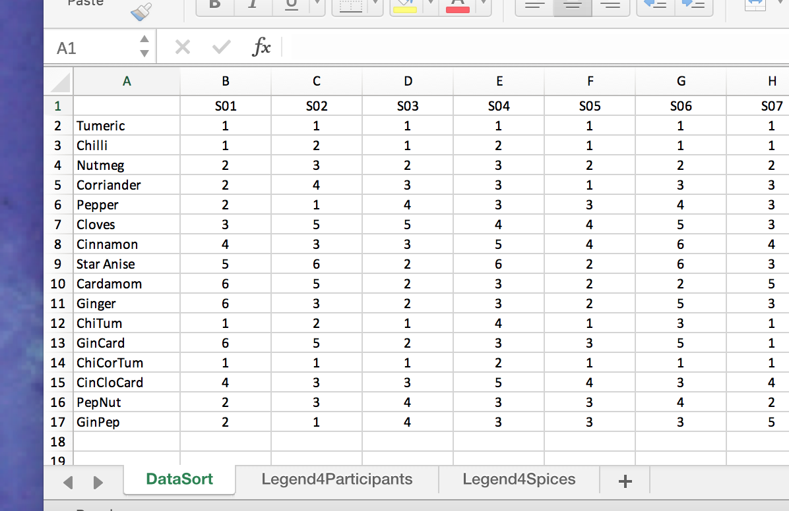

```{r setup, include = FALSE, ECHO = FALSE}
# Important: Remember 
#     build the vignettes with devtools::build_vignettes()
knitr::opts_chunk$set(
  collapse = TRUE,
  fig.width = 9,
  comment = "#>"
)
```


```{r, eval = FALSE,ECHO = FALSE , include = FALSE}
knitr::opts_knit$get()


```{r note, include = FALSE, ECHO = FALSE, eval = FALSE}


**NOTE:** 

This `pdf` was generated from the vignette
`R4SPISE2018::cheeseMCA` from the `R` Package 
`R4SPISE2018`. Check the help for the 
very last version of this document.
```


This `pdf` was generated from the vignette
`R4SPISE2018::cheeseMCA` from the `R` Package 
`R4SPISE2018`. Check the help for the 
very last version of this document.

# Prelude

If you want to make sure that you have a clean start,
you can execute the following commands:
```{r , include = FALSE}
rm(list = ls())
graphics.off()
```
Or, better, you can use an `Rproject` for this project (see
preamble below).


# Preamble


Make sure that your start this analysis as a new `Rproject` so that
the default directory will be correctly set.

Before we start the analysis,
we need to have our three standard packages installed from `Github`) 
and the corresponding libraries loaded:

* `DistatisR`
* `PTCA4CTA`
* `R4SPISE2018`

We also need some other packages namely:

```{r loadPackages}
# Decomment all/some these lines if the packages are not installed
# devtools::install_github('HerveAbdi/PTCA4CATA')
# devtools::install_github('HerveAbdi/DistatisR')
#  install.packages(prettyGraphs)
#  install.packages('Matrix')
#
#  load the libraries that we will need
suppressMessages(library(Matrix))
suppressMessages(library(factoextra))
suppressMessages(library(DistatisR))
suppressMessages(library(PTCA4CATA))
suppressMessages(library(prettyGraphs))
suppressMessages(library(ExPosition))


```


# Introduction

The data set can be found from the package `R4SPISE2018.`
The data are stored in an excel file called 
`multiculturalSortingSpices.xlsx` whose location
can be found and stored in the
variable `path2file` using the  `R` function `system.functionfile()`
as shown in the following command:
```{R findDataPath}
path2file <- system.file("extdata",
       "multiculturalSortingSpices.xlsx", package = "R4SPISE2018")
```


```{r xls.datafile, echo=FALSE, fig.cap="The Data Excel File \\label{fig:spicesxl}", fig.height=3, fig.width=4, include=TRUE, out.width='70%'}
# label.spicesxl = capFigNo
# 


```

if you open this excel file, it will look like the
Figure above. 
The sorting data are stored in the sheet `DataSort.`
In this sheet,
the first column gives the names of the products 
(here spices) and the following columns give how
each Judge sorted the products: The products that
were sorted together are assigned the same number
(arbitrarily chosen).


When you record you own data,
make sure that you follow the same format, this way the script
described in this vignette will apply 
to your own analysis with minimal change.

We will first compute the results of the analysis, then create 
the graphics, and finally save everything into a powerpoint.

# Run the statistical analysis

## Read the data

The excel file name and location (i.e., path) are
stored in the variable `path2file`. 
To read the data we will use the function
`DistatisR::read.df.excel()` (based upon
the function `readxl::read_excel()`).
```{r resdSortingData}
multiSort.list <- read.df.excel(path = path2file, sheet = 'DataSort')
multiSort <- multiSort.list$df.data
```
The raw data are now stored into the list `multiSort.list` 
where the sorting data are in the 
`dataframe` called `multiSort.list$df.data`.
(this structure is used so that when the assessors 
describe their sort with words, 
the vocabulary is stored in the same list
here the vocabulary would have been stored in 
`multiSort.list$df.voc`).
The sorting data are stored in the dataframe `multiSort`.

### To save the file

To save the data file 
(under the original name of `myDataFile`
or maybe a more informative name)
in a directory 
(called, for example, `Downloads`), use the following command:
```{r savexls}
saveFile <- file.copy(from = path2file, to = '~/Downloads/myDataFile.xlsx')
```


### Check (eye-balling) the data

To make sure that we have read the correct file we can 
peek at the dataframe `multiSort` and look at the data for
the first 5 spices of 
the first 10 assessors:.
```{r peekASort}
knitr::kable(multiSort[1:5,1:10])
```


The nationality of the assessors is indicated by the 
first letter of their name and and so 
 we can create a vector (called `descJudges`) giving the nationality of
 the assessors by extracting the first letter 
of their names:
```{r descJudges}
descJudges <- substr(colnames(multiSort),1,1)
```

Also, we are going to associate a color to each country for the Judges, 
using the function `createColorVectorsByDesign()`
from the package `prettyGraphs.`
```{r colJudges}
# Create a 0/1 group matrix with ExPosition::makeNominalData()
nominal.Judges <- makeNominalData(as.data.frame(descJudges))
# get the colors
color4Judges.list <- prettyGraphs::createColorVectorsByDesign(
              nominal.Judges)
# color4Judges.list
```

## Get the brick of distance

The first step of the analysis is to transform the sorting data
into a brick of distance matrices. 
This is done with the function
`DistanceFromSort()`'
```{r getCube}
DistanceCube <- DistanceFromSort(multiSort)
```

## Run plain DISTATIS

The brick of distance matrices (`multiSort`) is used
as the argument of the function `distatis` that will compute
the plain DISTATIS for the sorting task.


```{r runDistatis}
resDistatis <- distatis(DistanceCube)
```
The list `resDistatis` contains the results of the analysis,
this list contains two lists: 
The first one
called `resDistatis$res4Cmat` contains
the results for the $R_V$ analysis
(the $R_V$ matrix is also called the **C** matrix);
The second one called `resDistatis$res4Splus`
contains the results for the analysis of the
compromise (called the **S** matrix) .
If you have forgotten the output format of `distatis`,
or want to have more information: have a look
at the help for the function`distatis()`: 
in the console type
`?distatis`, or print `resDistatis`.


## Get group means in the RV space

We want to find if there are differences between the 
different national groups of judges.
The first step is to compute the mean of 
each of the groups and their bootstrap confidence intervals

```{r rvGroups}
# Get the factors from the Cmat analysis
G <- resDistatis$res4Cmat$G 
countryMeans.tmp <- aggregate(G, list(descJudges), mean) 
countryMeans <- countryMeans.tmp[,2:ncol(countryMeans.tmp )] 
rownames(countryMeans) <- countryMeans.tmp[,1]
# countryMeans[,1:4]
BootCube <- PTCA4CATA::Boot4Mean(G, design = descJudges,
                       niter = 100,
                       suppressProgressBar = TRUE)
# head(BootCube)
```

## Compute partial map (countries)

The compromise is obtained as a weighted sum of the
$\alpha_j\mathbf{S}_j$ with each of the  $J$ judges belonging to one
of $K$ groups (i.e., country).
In plain DISTATIS, each observation can be projected onto
the compromise; in a similar manner, when the 
assessors are nested into another group factor (e.g., countries), 
we can project 
these groups onto the compromise.
The easiest way to do so is to use the partial projections
and compute the weighted sum corresponding to each group.

```{r computeSk}
F_j     <- resDistatis$res4Splus$PartialF
alpha_j <- resDistatis$res4Cmat$alpha
# create the groups of Judges
groupsOfJudges <- substr(names(alpha_j),1,1)
code4Groups <- unique(groupsOfJudges)
nK <- length(code4Groups)
# initialize F_K and alpha_k
F_k <- array(0, dim = c(dim(F_j)[[1]], dim(F_j)[[2]],nK))
dimnames(F_k) <- list(dimnames(F_j)[[1]], 
                         dimnames(F_j)[[2]], code4Groups)
alpha_k <- rep(0, nK)
names(alpha_k) <- code4Groups
Fa_j <- F_j
# A horrible loop
for (j in 1:dim(F_j)[[3]]){ Fa_j[,,j]  <- F_j[,,j] * alpha_j[j] }
# Another horrible loop
for (k in 1:nK){
  lindex <- groupsOfJudges == code4Groups[k]
  alpha_k[k] <- sum(alpha_j[lindex])
  F_k[,,k] <- (1/alpha_k[k])*apply(Fa_j[,,lindex],c(1,2),sum)
}

```


# Graphics

Most of the graphics will be created with either
`prettyGraphs` or with `PTCA4CATA`,
The graphs will be saved in a powerpoint file.

## The RV analysis

### Scree plot for RV
In the first map we create the RV map 

```{r RV.scree.MapPlain, fig.height=4, fig.width= 7, }
# 5.A. A scree plot for the RV coef. Using standard plot (PTCA4CATA)
scree.rv.out <- PlotScree(ev = resDistatis$res4Cmat$eigValues, 
                   p.ev = NULL, max.ev = NULL, alpha = 0.05,
                   col.ns = "#006D2C", col.sig = "#54278F",
                   title = "RV-map: Explained Variance per Dimension", 
                   plotKaiser = FALSE,
                   color4Kaiser = "darkorchid4", 
                   lwd4Kaiser = 2.5)
a1.Scree.RV <- recordPlot() # Save the plot
```


### Factor Map for RV

```{r RVGplot}
# Create the layers of the map
gg.rv.graph.out <- createFactorMap(X = resDistatis$res4Cmat$G, 
                            axis1 = 1, axis2 = 2, 
                            title = "Judges: RVMap", 
                            col.points = color4Judges.list$oc, 
                            alpha.points = 0.5,
                            display.points = TRUE, 
                            pch = 19, cex = 2.5, 
                            display.labels = TRUE,
                            col.labels = color4Judges.list$oc, 
                            alpha.labels = 1, text.cex = 4,
                            font.face = "bold", font.family = "sans", 
                                   col.axes = "darkorchid",
                                   alpha.axes = 0.2, width.axes = 1.1,
                            col.background = adjustcolor("lavender", 
                                                       alpha.f = 0.2), 
                            force = 1,
                            segment.size = 0)
# # Create the map from the layers
a2a.gg.RVmap <- gg.rv.graph.out$zeMap + 
     createxyLabels.gen(
       lambda = resDistatis$res4Cmat$eigValues , 
       tau    = resDistatis$res4Cmat$tau,
       axisName = "Dimension ")
# NB could be of interest to color the Assessors by condition 
#        rather than using their names. Done below
a2b.gg.RVmap <- gg.rv.graph.out$zeMap_background +
                gg.rv.graph.out$zeMap_dots +
                createxyLabels.gen(
                  lambda = resDistatis$res4Cmat$eigValues , 
                  tau    = resDistatis$res4Cmat$tau,
                  axisName = "Dimension ")

```

### Print the RV map

To print the RV map we simply use the function `print()`
as described below:

```{r mapa2a, fig.height=6, fig.width= 9}
print(a2a.gg.RVmap )
```

### An RV map with group means and confidence intervals

```{r RVwithCI}
# First the means
# A tweak for colors
in.tmp    <- sort(rownames(color4Judges.list$gc), index.return = TRUE)$ix
col4Group <- color4Judges.list$gc[in.tmp]
#
gg.rv.means <- PTCA4CATA::createFactorMap(countryMeans,
axis1 = 1, axis2 = 2, 
constraints = gg.rv.graph.out$constraints, title = NULL,
col.points =  col4Group ,
alpha.points = 1, # no transparency
display.points = TRUE,
pch = 19, cex = 5,
display.labels = TRUE,
col.labels = col4Group , 
  text.cex = 4,
font.face = "bold",
font.family = "sans", col.axes = "darkorchid", 
alpha.axes = 0.2, width.axes = 1.1, 
col.background = adjustcolor("lavender", alpha.f = 0.2), 
force = 1, segment.size = 0)
#
 dimnames(BootCube$BootCube)[[2]] <- 
                    paste0('dim ',1: dim(BootCube$BootCube)[[2]])
  #c('Dim1','Dim2') 
GraphElli.rv <- MakeCIEllipses(BootCube$BootCube[,1:2,],
                 names.of.factors = c("dim 1","dim 2"), 
                 col = col4Group, 
                 p.level = .95)
a2d.gg.RVMap.CI <- a2b.gg.RVmap + gg.rv.means$zeMap_dots + GraphElli.rv 

# countryMeans[,1:2]
```


The means of the assessors from the 5 countries differs 
as can be seen in the table of mans for the first three dimension

```{r meansRV}
knitr::kable(countryMeans[,1:3])

```

To evaluate the significance of these differences, we plot
the means and their bootstrapped derived confidence intervals
on the RV map. 
This map pinpoints one significant difference 
between the
Vietnamese and the American group (see below).

```{r mapa2d, fig.height=6, fig.width= 9}
print(a2d.gg.RVMap.CI )
```


## Post-Hoc Analysis: Exploring the individual participants between participants

Here we conduct a hierarchical cluster analysis on the factor scores
of the RV matrix.


```{r HCA}
 D <- dist(resDistatis$res4Cmat$G, method = "euclidean")
 fit <- hclust(D, method = "ward.D2")
 a05.tree4participants <- fviz_dend(fit,  k = 1, 
                        k_colors = 'burlywood4', 
                        label_cols = color4Judges.list$oc[fit$order],
                        cex = .7, xlab = 'Participants',
                        main = 'Cluster Analysis: Participants') 
```

```{r plothca, fig.height = 9, fig.width = 9}
 print(a05.tree4participants)
```


The cluster analysis suggests 
that there are groups of participants, but how many groups
maybe more difficult to evaluate.
Also, the  cluster analysis confirms that nationalities is not 
a strongly segmenting factor (because the colors do
not strongly cluster on the tree).


## The compromise

### Scree for the compromise
First a scree plot of the compromise

```{r scree4S, fig.height=4, fig.width=7}
#---------------------------------------------------------------------
# A scree plot for the Compromise.
S.eig <- eigen(resDistatis$res4Splus$Splus, 
               symmetric = TRUE, 
               only.values = TRUE)$values
scree.S.out <- PlotScree(
              ev = S.eig, 
              p.ev = NULL, max.ev = NULL, alpha = 0.05,
              col.ns = "#006D2C", col.sig = "#54278F",
              title = "Compromise: Explained Variance per Dimension", 
              plotKaiser = FALSE,
              color4Kaiser = 
              "darkorchid4", lwd4Kaiser = 2.5)
b1.Scree.S <- recordPlot()
#---------------------------------------------------------------------
```


### The compromise


```{r createGr4S}
# 4.1 Get the bootstrap factor scores (with default 1000 iterations)
BootF <- BootFactorScores(resDistatis$res4Splus$PartialF)
# 5.2 a compromise plot
# General title for the compromise factor plots:
genTitle4Compromise = 'Spices: Compromise.'
# To get graphs with axes 1 and 2:
h_axis = 1
v_axis = 2
# To get graphs with say 2 and 3 
# change the values of v_axis and h_axis
color4Spices <- #  Create color for the Products from prettyGraph
 prettyGraphsColorSelection(n.colors = nrow(resDistatis$res4Splus$F))
gg.compromise.graph.out <- createFactorMap(resDistatis$res4Splus$F,
                                    axis1 = h_axis, 
                                    axis2 = v_axis,
                                    title = genTitle4Compromise,
                                    col.points = color4Spices ,
                                    col.labels = color4Spices 
) 

b2.gg.Smap <-  gg.compromise.graph.out$zeMap + createxyLabels.gen(
  x_axis = h_axis, y_axis = v_axis,
  lambda = S.eig , 
  tau    = round(100* S.eig / sum(S.eig)),
  axisName = "Dimension ")
#  
# 5.4 a bootstrap confidence interval plot 
# 5.3  create the ellipses
gg.boot.graph.out.elli <- MakeCIEllipses(
                              data = BootF[,c(h_axis,v_axis),],
                              names.of.factors = 
                                c(paste0('Factor ',h_axis),
                                  paste0('Factor ',v_axis)),
                              col = color4Spices,
)  
# Add ellipses to compromise graph
b3.gg.map.elli <- gg.compromise.graph.out$zeMap + 
  gg.boot.graph.out.elli +
  createxyLabels.gen(
    x_axis = h_axis, y_axis = v_axis,
    lambda = S.eig , 
    tau    = round(100* S.eig / sum(S.eig)) ,
    axisName = "Dimension ")
#
```


```{r plot4S, fig.height=6, fig.width= 9}
print(b2.gg.Smap)
```

## Map of compromise with partial factor scores


```{r PartialFS}
# get the partial map
map4PFS <- createPartialFactorScoresMap(
  factorScores = resDistatis$res4Splus$F,      
  partialFactorScores = F_k,  
  axis1 = 1,
  axis2 = 2,
  colors4Items = as.vector(color4Spices), # default is NULL
  colors4Blocks = NULL,  #  c('blue','red')
  names4Partial = dimnames(F_k)[[3]], # Short names default is NULL
  alpha.lines  = .5,
  size.lines   = .75,
  type.lines = 1,
  arrow.length = 0,
  alpha.points = .7,
  shape.points = 23,
  size.points  = 1,
  alpha.labels = .7,
  font.labels = 'bold',
  family.labels = 'sans',
  size.labels  = 2)

d1.partialFS.map.byProducts <- gg.compromise.graph.out$zeMap + map4PFS$mapColByItems
d2.partialFS.map.byCategories  <- gg.compromise.graph.out$zeMap + map4PFS$mapColByBlocks
```

```{r SwithCategories.1, fig.height=6, fig.width= 9, message = FALSE, warning = FALSE, error = FALSE}
print(d1.partialFS.map.byProducts )
```

```{r SwithCategories.2, fig.height=6, fig.width= 9, message = FALSE, warning = FALSE, error = FALSE}
print(d2.partialFS.map.byCategories)
```


# Save the graphics as a powerpoint

```{r}
name4Graphs = 'SortingSpices.pptx'
```
The graphics are saved as a powerpoint with the following command
`r name4Graphs`

```{r saveGraphs, message = FALSE, warning = FALSE, error = FALSE, eval = FALSE}
toto <- PTCA4CATA::saveGraph2pptx(file2Save.pptx = name4Graphs, 
                 title = '5 Cultures and 16 Spices ', 
                 addGraphNames = TRUE)
```


Note that we could also have created a powerpoint with
`Rmarkdown` by using the following options in the 
preamble:

```{r powerpoint,  message = FALSE, warning = FALSE, error = FALSE, eval = FALSE}
output:
      powerpoint_presentation:
           slide_level: 4
```

instead of (for example):

```{r vignettes,  message = FALSE, warning = FALSE, error = FALSE, eval = FALSE}
output:
       rmarkdown::html_vignette:
          toc: true
          number_sections: true
```          

